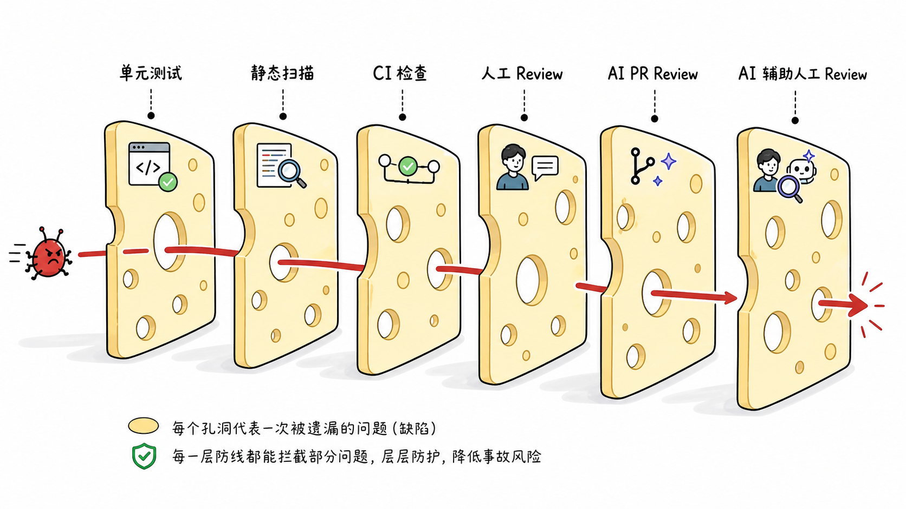
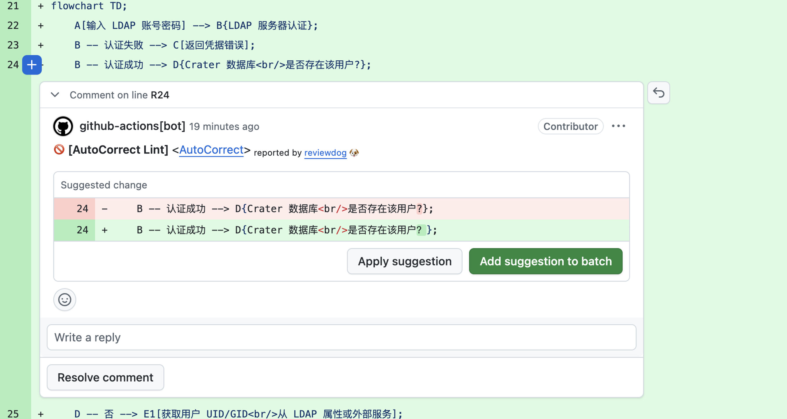
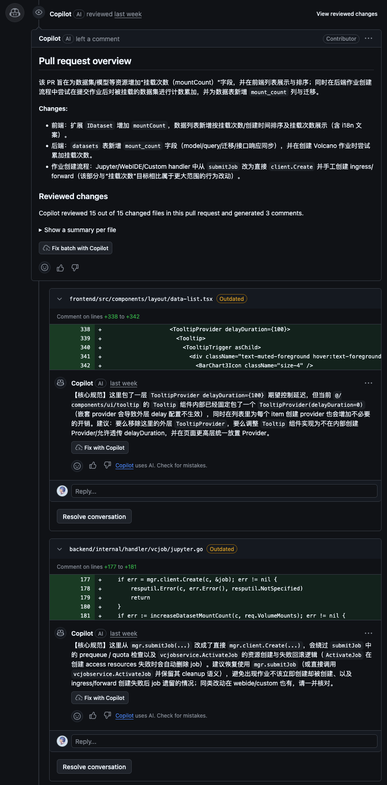
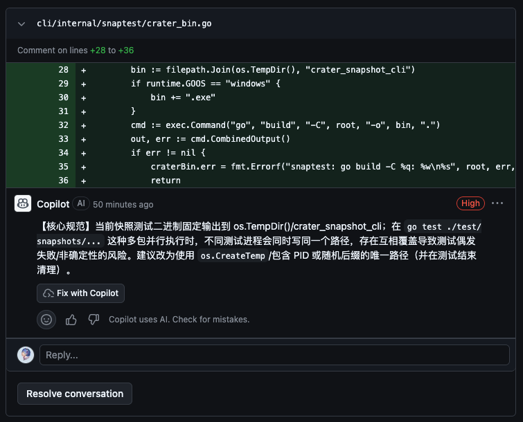
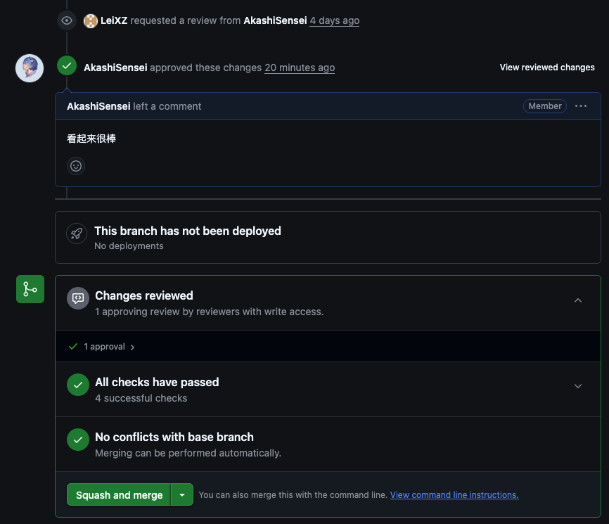
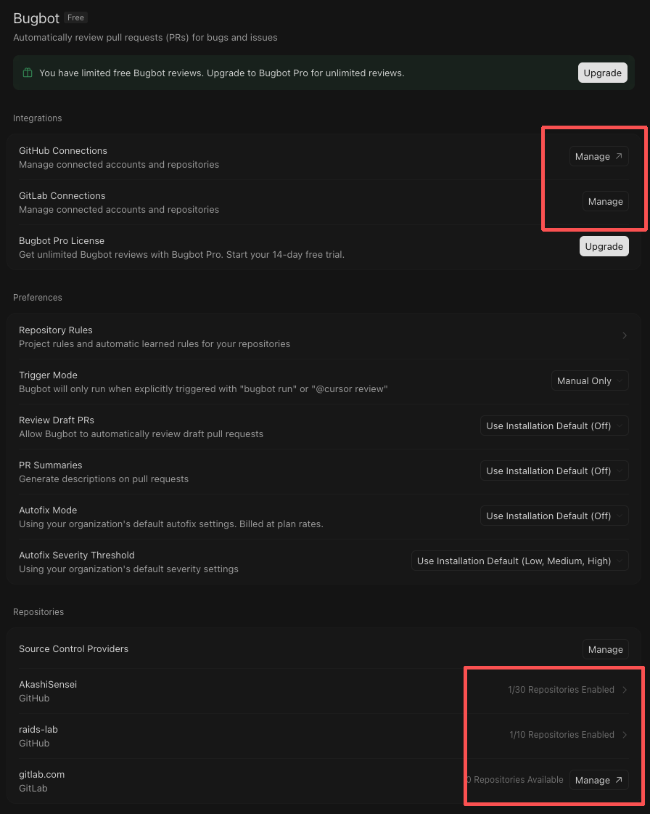
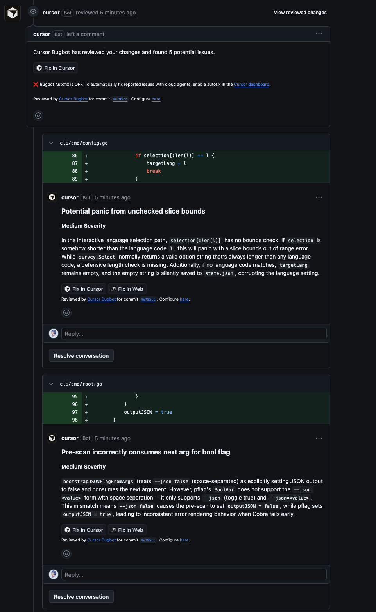
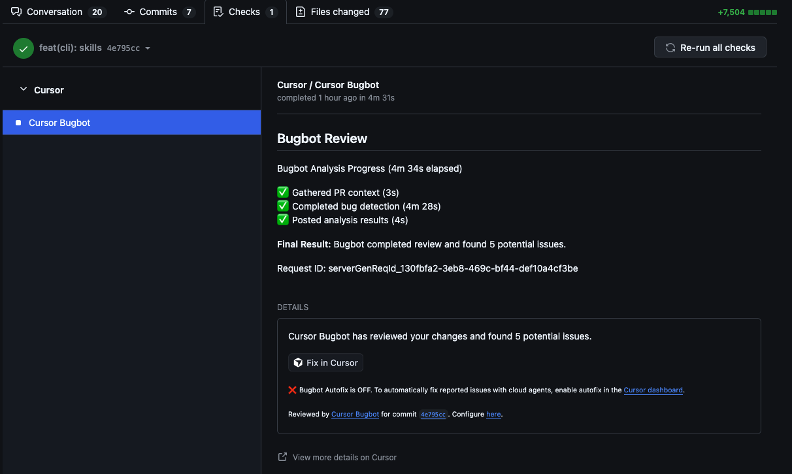

AI 来 review PR：要不要？怎么做？


AI review 不是什么很新鲜的东西了，各个厂商不仅提供了对 GitHub 上 Pull Request 的 review，还提供了内嵌在 IDE 中的各种 review 功能，现在社区也有用来 review 的 skills 等等。

这里我们主要介绍的是对 GitHub PR 的 review，包括 Copilot code review 和 Cursor Bugbot。相比于其它的 review 形式，review PR 最大的优势是，对于团队或开源项目，AI review 的记录能够优雅地留存在 PR 中，方便团队的人类成员进一步检查、讨论代码变更以及 review 意见本身。

对于这类 AI PR review，本文将会回答这些问题：
- 真的有用，还是心理安慰？
- 能力边界在哪，它能做到什么程度？
- 值不值，该不该上，省时间、提质量还是添麻烦？
- 如何开始？
- 如何让它做的更好？
- 有什么问题，有什么坑？

先说关键结论。经过一段时间的使用，我觉得现在这类 AI review 的 Harness 和模型能力都有待加强，但是绝对是值得使用的，尤其是在代码几乎都是 AI 写的情况下，尤其是在中大型的多开发者/开源项目中，多这样一层上下文与开发环境独立的检查，能够帮助发现不少问题。

我们可以从“瑞士奶酪模型”的角度来理解代码审查和软件事故。在该模型中，安全机制表示为多片叠在一起的奶酪片，每层奶酪片表示一个安全机制，每个奶酪片上都有很多的洞，表示该安全机制不能覆盖的范围或者“漏洞”。把这些有漏洞的奶酪片叠起来看，如果一个错误穿过了所有的奶酪片，也就是所有的安全机制对于这个问题都失效了，那么它最终就会导致错误。模型中奶酪片的形状是动态变化的。



一方面，我们可以把 AI PR review 看成一片单独的奶酪片，从这个角度来说，它算不上优秀的 reviewer，或者说它的“孔洞”太多了，而且有的时候还会误报。但是另一方面，如果从另一个角度来看，把它看作某一个奶酪片的一部分，或者对现有奶酪片的增强，那么它是合格的，至少已经能够比较好地辅助人类开发者和人类 reviewer 了。

现在的 AI 开发者对代码变更看的越来越少了，大家基本都是看看让 AI 写的功能正不正常，正常的话直接就交了。但是 AI 为了达到目标的所使用的实现方式很可能不够优雅甚至有问题，比如修改一些被大量复用的核心组件，虽然实现了当前任务，但是却导致其它功能不正常；或是逻辑有缺陷，会导致死锁等等。对于我们现在的项目，一个完整的功能常常会修改几十个文件，如果让人类 reviewer 一个一个从头到尾看太费劲了，此时让 AI 扫一遍代码变更，能以很低的时间成本发现不少有价值的问题。

---

# GitHub Copilot code review

借用我们团队的项目来说明和展示 Copilot code review。

## 快速开始

要使用 Copilot code review，要求开发者必须至少有 Copilot Pro 计划，教育优惠赠送的就可以。或者要求所在组织拥有 Copilot Business 或者 Copilot Enterprise 计划，并由所有者启用相关功能。详见 [Availability](https://docs.github.com/en/copilot/concepts/agents/code-review#availability)。

确认具备了先决条件之后，我们可以依照 [Using Copilot code review](https://docs.github.com/en/copilot/how-tos/use-copilot-agents/request-a-code-review/use-code-review?tool=webui#using-copilot-code-review) 文档的说明，在网页端 GitHub 上快速让 Copilot review 我们的 PR。只需要在 PR 的 Reviewers 中选择 Copilot 即可，可以在创建 PR 时直接添加，也可以为已经创建好的 PR 添加，都能正常触发 Copilot 的 review。当然，通过 GitHub CLI 同样也能触发 Copilot 的 review，只需要使用诸如 `gh pr create --reviewer @copilot` 或者 `gh pr edit PR-NUMBER --add-reviewer @copilot` 添加 Copilot 作为 Reviewers 即可。此外，我们可以在仓库中设置，自动为 PR 使用 Copilot code review。


如果没有 Copilot 这个 reviewer，那么说明当前仓库并不具备使用 Copilot code review 的条件，请检查是否开启了相关设置，以及用户或组织是否拥有 Copilot 计划。

在 Reviewers 中选择了 Copilot 之后，Copilot 就会 review 我们的 PR，整个过程大概需要几分钟，然后就能够在 PR 页面看到类似于人类 reviewer 的评论，包含一个对 PR 的概述，以及对具体变更代码的评论，如图所示。


这是一个最基础最原始的 review 结果，没有进行任何额外或者针对性的配置，此时 Copilot 会像一个专业但不资深的工程师，检查代码变更中的问题。

在这个阶段，Copilot code review 就已经能够帮助我们发现一些比较通用的问题了，但它就像从其它项目中“借”来的工程师一样，能够发现一些普适的问题，却没有在项目上的针对性知识沉淀和积累，即使它能够参考整个仓库的代码（除了一些依赖文件比如 `package.json` 、日志、SVG 文件和生成的文件等等）。

## 能力边界

我们还能让它变得更强，把它打造成具备仓库沉淀知识的专属工程师，但是在这之前，我们首先需要了解一下它的能力边界。

首先，不同于人类 reviewer 的是，Copilot 不能给出 Approve 和 Request changes，只能留下 Comment。也就是说，如果 PR 质量很差，Copilot 不能阻止合并；如果代码质量很棒，Copilot 也不计入所要求的 reviewer 与 approve。

Copilot 在 review 的时候会参考 PR 标题、描述，但是似乎不能参考 PR 已有的评论。

对于 Copilot 建议的修改，它可以自己使用 Cloud Agent 进行修复，引用自己的 review 修改建议，并直接提交到对应的分支上。但是不建议使用这个功能，更推荐的做法是人类开发者根据建议手工修改，一方面可能不是所有的都需要，另一方面建议的修改可能通过不了 Lint 之类的 workflow。

或者，通过 GitHub 网页端提供的功能，直接应用 suggestion 到 commit。具体的做法是，在 PR 的 Files changed 选项卡中，选择对应的 comment，跳转到具体的文件中，然后找到 Copilot 留下的行内评论，选择 Apply suggestion 或者 Add suggestion to batch，应用单个或批量应用修改建议。




这里的图示不是来自 Copilot 的建议，而是我们仓库另一个 bot 的修改建议，不过本质上是一样的，这是 GitHub Web 提供的功能。

如果回复 Copilot 的 Comment，Copilot 不会做出回复。但是如果开发者修改了代码并重新提交，更新了 PR，可以在 Reviewers 中要求 Copilot 重新 review，具体的做法是点击 Copilot 右侧的小刷新按钮，即 Re-request review，之后 Copilot 就会重新 review 最新的修改。但是需要注意的是，如果没有修改相应的代码，Copilot 可能会反馈与之前相同的问题，即使原先的评论被「已解决/已点踩/已有讨论」，这些操作并不能抑制重复反馈。


最后，也是十分重要的一个功能，我们可以通过在仓库中添加自定义的指令来进一步约束和增强 Copilot code review 的行为和知识，将在下一节中重点介绍。

## 自定义指令

可以通过在代码仓库的 `.github` 目录下添加指令文档，来为 Copilot 的 cloud-agent 和 code-review 提供自定义指令，这里我们主要讨论 code-review 的部分，详见 [Adding repository custom instructions for GitHub Copilot](https://docs.github.com/en/copilot/how-tos/copilot-on-github/customize-copilot/add-custom-instructions/add-repository-instructions)。

具体来说，可以创建一个 `.github/copilot-instructions.md` 作为仓库级 Copilot 指令，同时应用于 cloud-agent 和 code-review；也可以在 `.github/instructions` 下创建多个 `NAME.instructions.md`，并使用 YAML Front Matter 指定其面向的智能体和代码，例如：

```
---
applyTo: "**/*.ts,**/*.tsx"
excludeAgent: "code-review"
---
```

在我们项目的实践中，我同时使用了这两种方式。

在仓库全局的指令中，我主要约束了 code-review 的总体行为，比如要求使用简体中文，要求在提出修改建议时参考项目中类似的功能实现，并提醒开发者直接应用 suggestion 可能导致无法通过 workflow。此外，我还尝试规定它给出总览评论和行内评论时的格式。Copilot 能够遵守行内评论的格式约束，但是不能修改总览评论的格式，只能修改语言，这里内置的系统提示词应该是做了比较强的约束。具体参见我们的 [Crater 项目通用准则](https://github.com/raids-lab/crater/blob/main/.github/copilot-instructions.md)。

此外，我也为项目的前后端代码、文档和 Helm Charts 分别创建了对应的 path-specific 指令文档，进一步通过自然语言描述了对应内容的开发和审查规范。比如，对于前后端，明确了要尽量复用已有的风格和组件代码，并不要修改被大量复用的组件；对于文档，要求在一些涉及版本的地方使用提供的占位符，方便在编译时被替换为真实的版本号，并约束了一些专用名词的用法；对于 Helm Chart，要求同步更新版本号。这些知识基本上是开发团队在这个项目上的经验和约定，主要“蒸馏”自创建这个项目的师兄，我又进行了一些补充，详见 [扩展指令目录](https://github.com/raids-lab/crater/tree/main/.github/instructions)。此外，在现在的我看来，不止使用自然语言，而是给出一些具体的正反例可能能让 AI 有更好的表现。



这个版本即是应用了专有指令后的 Copilot code review 结果，除了使用了简体中文，还能够提出针对性强很多的修改意见。虽然所谓「核心规范」和「优化建议」的划分可能并不是特别严谨，但是这不重要，它已经能够帮忙发现很多有价值的问题了。在它的帮助下，人类 reviewer 只需要判断下它提出的问题是否真实存在、是否需要修改即可，这比发现问题要容易很多。



顺带一提，这两天新增了显示对应建议优先级或严重程度的功能，也就是这张图里显示的 High 标签，这个是这次 review Copilot 给出的 4 个建议中的第一个，后面还有 Medium 和 Low。这也印证了我之前的想法，实际上 Copilot 可能发现了很多问题，但它每次只选择它觉得最严重的 3-4 个给出。所以从实际使用上来说，建议多与 Copilot 迭代几次，即修改完了再让它 review 下，知道出现的问题基本上都是无关紧要的问题，这将显著提高代码健壮性。



虽然我没有自己再进行测试或是仔细检查代码逻辑，但是看到开发人员与 Copilot 迭代多次，解决了许多关键的问题，并对不需要修复的问题作出了回复，确实十分令人放心的。显示 4 days ago 是因为五一摸鱼了，在这里向这位开发者师兄说声不好意思（

---

# Cursor Bugbot

Bugbot 会评审 PR，并识别 bug、安全问题和代码质量问题，详见 [Bugbot](https://cursor.com/cn/docs/bugbot)。顺带一提，Cursor 的中文文档做得要比 GitHub 的好不少，GitHub 的中文文档能不能到人类可读的水平都不好说。

这实际上和 GitHub Copilot code review 非常类似，不说得那么细致了，但是和 GitHub 的集成自然没有 Copilot 那么紧密，不过也非常好了，用起来也很方便。

相比于 Claude Code、Codex 等，Cursor 依旧是我用的最多的 AI 工具，但是 Bugbot 功能却用的不多。

需要注意的是，这个是独立计费的，独立于 Cursor Pro 之类的计划。

## 能力边界

基本上与 GitHub Copilot code review 类似：
- 只能留下 Comment，不能 Approve 或者 Request changes；
- 可以配置自动 review，以及代码更新后自动重新评审；
- 同样可以配置各个层级的规则：可以在项目根目录和各个子目录中配置对应范围的审查指令或者特定上下文，也可以通过 glob 来限定对应规则作用的路径，可以让 Bugbot 自动启用或禁用规则，还能直接在 PR 中评论 `@cursor remember [fact]` ，直接让 Bugbot 记住新规则，详见[代码仓库规则](https://cursor.com/cn/docs/bugbot#-9)；
- 同样可以通过 Cloud Agent 自动修复问题；
- 不同于 Copilot，Bugbot 会读取 PR 中已有的评论，这样也能够避免重复反馈相同的问题；
- 能够在 Cursor 仪表盘中看到比较详细的 review 统计与分析。

## 快速开始

需要在 Cursor 仪表盘中连接仓库，才能使用 Bugbot，详见[设置](https://cursor.com/cn/docs/bugbot#-1)。这里以 GitHub 为例进行简要说明。

1. 连接到 GitHub；
2. 开启对目标仓库的访问，进行相关的设置。



需要注意的是，Bugbot 只会 review 你的 PR，而不能 review 仓库中其它开发者的 PR。

同样可以进行自定义指令/规则，但是和 Copilot 不太一样，不是通过项目根目录中统一的 `.github/instructions` 中不同指令文档的 `applyTo` 控制，而是通过把各个 `BUGBOT.md` 规则文档放到各个层级不同目录下的 `.cursor` 目录中来控制。


比如这样，这是提供给我一个简单的文档仓库的 Bugbot 规则。

## 效果与体验


这是 Bugbot review 上述小文档仓库的 PR 的结果。这个 PR 比较简单，并没有出现问题。



对另外一个 PR，这是我让 Cursor Bugbot 在 Copilot 之后，review 同一份 PR 的结果，由于该仓库没有设置 Bugbot 的规则，因此最终的输出还是英文的。可以看到 Bugbot 也可以显示严重程度，但是和 Copilot 显示的方式不太一样。另外正如文档中所说的，Bugbot 并没有反馈和已经出结果的 Copilot code review 相同的问题，而是提出了几个新的，但更有价值的问题。



还有个很神奇的点，Bugbot 的 review 竟然注入了一个对应的 check，也就是说是以类似流水线的方式进行的，还能看到更详细的进度和用时等信息。

---

# 总结和吐槽

总的来说很有实践价值，能帮忙再发现并解决更多的问题，提高代码质量。

个人体感 Cursor Bugbot 发现的问题要比 Copilot code review 更有价值，当然也可能是我的提示词造成的问题。但或许没必要对比二者，而是选择一起用，尤其是对于我们现在这种一个有仓库级 review 提示词一个没有的情况，让一个根据经验发现通用代码问题，另一个根据提示词发现更有针对性的细节问题，感觉也不错。


GitHub 集成做的挺好，但是感觉 Harness 和模型能力都一般，最离谱的是它自己竟然不清楚自己（Copilot code review）能够识别和接受的指令配置格式，让我改来改去。问 Copilot 插件，它也不知道自己的 code review 功能具体该怎么配置。

Cursor 好多功能都挺好，比如基于 Cloud Agent 的很多奇妙的功能，不仅局限于自动修复，手机远程访问等，还能像人类一样使用屏幕、鼠标、键盘等像外设完整的操作虚拟机，但是这些都需要开启 On-Demand Usage，好贵。Bugbot 还是单独计费的，哭哭。

我感觉这些 review 工具最大的问题是没有一个标准统一的仓库级自定义指令管理方式。比如对于 Crater 代码仓库，如果我想同时使用 GitHub Copilot 和 Cursor Bugbot，那么我就需要在同一个仓库下维护两套几乎一样的规则，或者设计某种机制来链接或同步它们，十分麻烦。对于开源项目这个问题更严重，我很难要求所有的开发者使用同样的 AI 工具，又难以为每个工具都提供一套规则。好在现在有了通用的 Skills，至少可以提供通用的开发 Skills 和开发侧的 review Skills。
