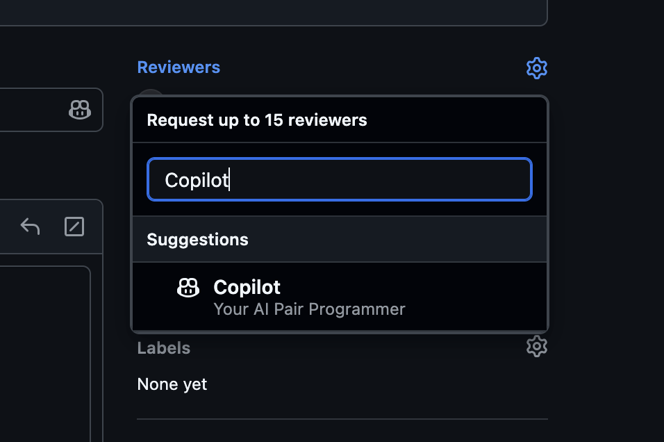
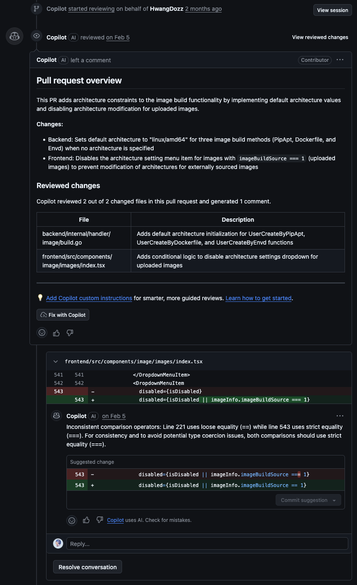
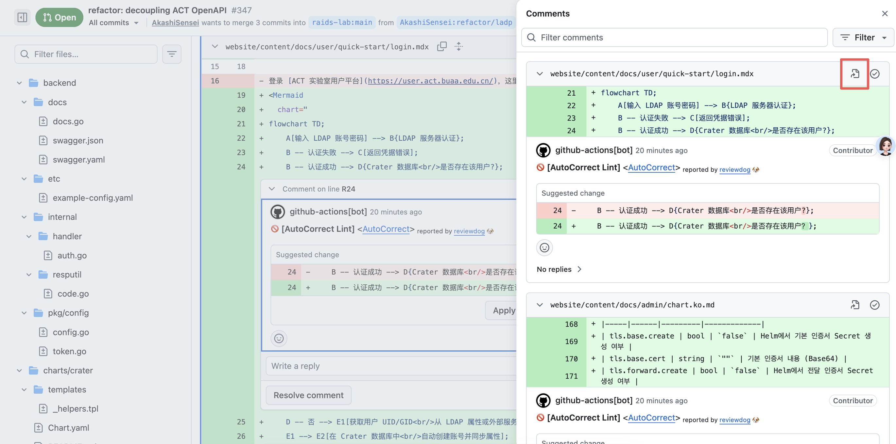
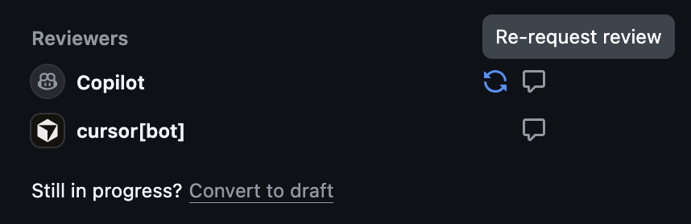
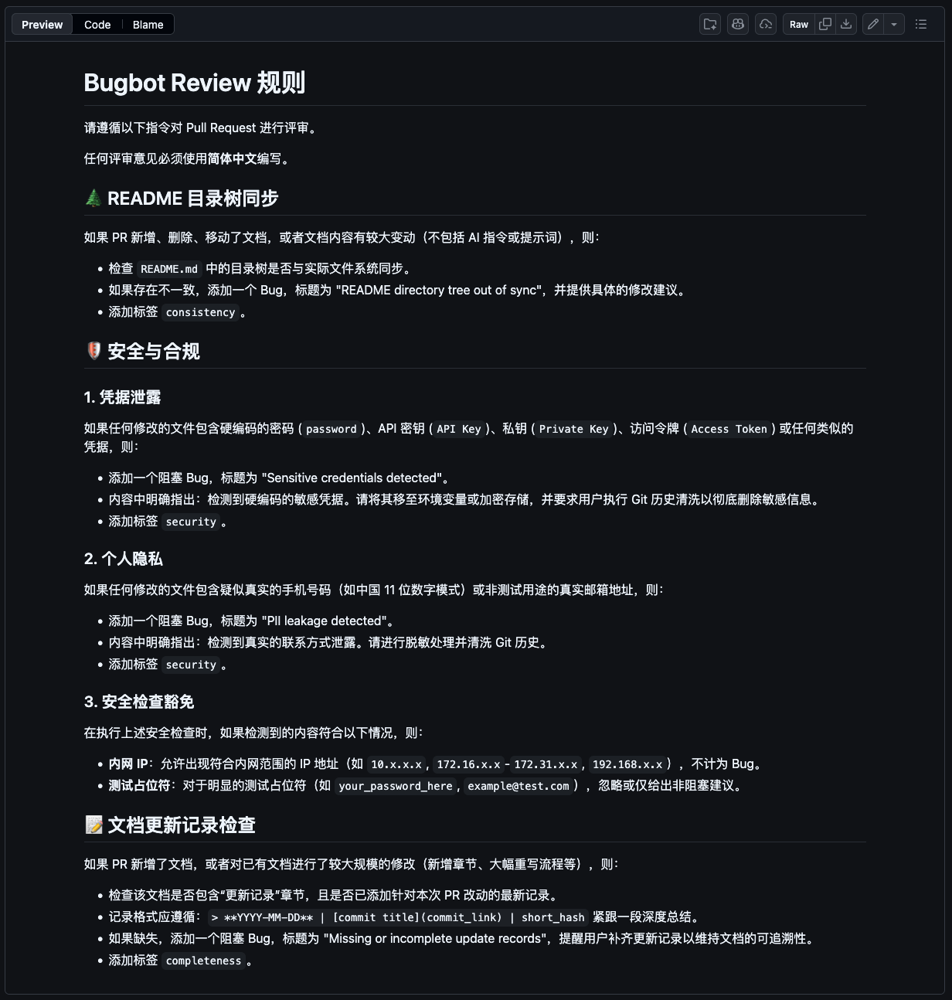
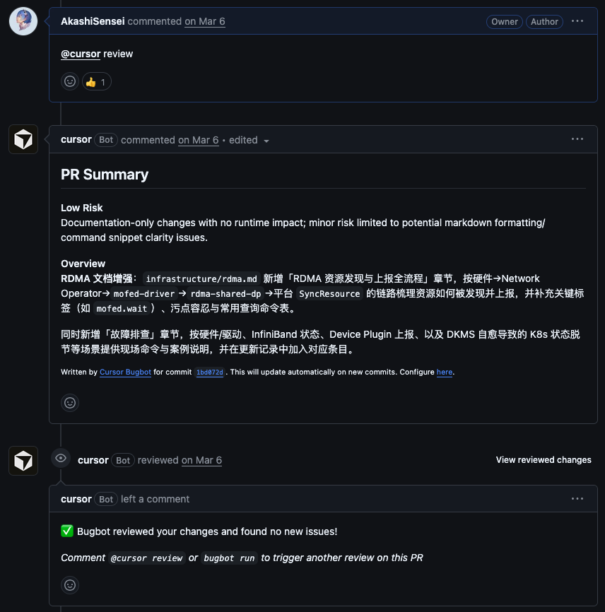
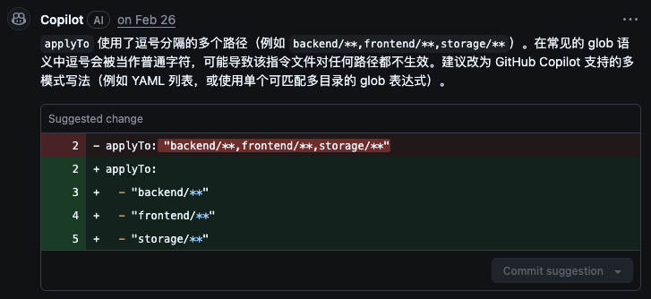
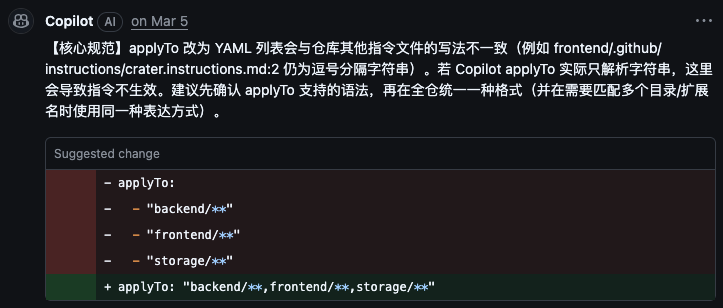

AI PR Review: Should You Use It, and How?


AI review is no longer a new idea. Vendors now provide review features for GitHub Pull Requests, IDE-integrated review tools, and community skills built specifically for review.

This article focuses on GitHub PR review, mainly GitHub Copilot code review and Cursor Bugbot. Compared with other forms of review, PR review has one major advantage: for teams and open-source projects, AI review records can stay naturally inside the PR, making it easy for human teammates to inspect the code changes, discuss them, and review the AI's comments themselves.

For this kind of AI PR review, this article answers several questions:
- Is it actually useful, or just psychological comfort?
- Where are its capability boundaries, and what can it really do?
- Is it worth adopting? Does it save time, improve quality, or create extra trouble?
- How do you get started?
- How do you make it work better?
- What problems and pitfalls should you expect?

Here is the key conclusion first. After using these tools for a while, I think both the harness and the model capability of current AI review tools still need improvement, but they are absolutely worth using. This is especially true when most of the code is already written by AI, and even more so in medium-to-large multi-developer or open-source projects. Adding one extra layer of checking that is independent from the original development context and environment can help catch quite a few problems.

We can understand code review and software accidents through the "Swiss cheese model." In this model, safety mechanisms are represented as multiple slices of cheese stacked together. Each slice represents one safety mechanism, and every slice has holes, meaning areas that the mechanism cannot cover or possible vulnerabilities. If an error passes through all the holes in all the slices, every safety mechanism has failed for that problem, and the error eventually causes an incident. The shapes of the holes are dynamic.


On the one hand, we can treat AI PR review as a standalone slice of cheese. From this perspective, it is not an excellent reviewer, or rather, it has too many holes, and sometimes it raises false positives. On the other hand, if we view it as part of another slice of cheese, or as an enhancement to existing slices, it is good enough. At minimum, it can already assist human developers and reviewers fairly well.

AI-assisted developers now read code changes less and less. Many people simply check whether the feature generated by AI appears to work, and if it does, they submit it. But the implementation AI uses to reach the goal may be inelegant or even problematic. For example, it may modify a heavily reused core component, which solves the current task but breaks other features; or it may introduce flawed logic that can cause deadlocks. In our current project, a complete feature often touches dozens of files. Asking a human reviewer to read them all from beginning to end is painful. In this situation, letting AI scan the code changes can catch many valuable issues at very low time cost.

---

# GitHub Copilot code review

I will use our team's project to explain and demonstrate Copilot code review.

## Quick start

To use Copilot code review, the developer must have at least a Copilot Pro plan; the education benefit is enough. Alternatively, the organization must have Copilot Business or Copilot Enterprise, and the owner must enable the related feature. See [Availability](https://docs.github.com/en/copilot/concepts/agents/code-review#availability).

After confirming the prerequisites, we can follow [Using Copilot code review](https://docs.github.com/en/copilot/how-tos/use-copilot-agents/request-a-code-review/use-code-review?tool=webui#using-copilot-code-review) and quickly ask Copilot to review a PR from the GitHub web UI. Just select Copilot in the PR's Reviewers. You can add it when creating the PR, or add it to an existing PR; both will trigger the review. You can also trigger it through GitHub CLI, for example with `gh pr create --reviewer @copilot` or `gh pr edit PR-NUMBER --add-reviewer @copilot`. In addition, you can configure the repository to automatically use Copilot code review for PRs.



If Copilot does not appear as a reviewer, the current repository does not meet the requirements for Copilot code review. Check whether the relevant settings are enabled and whether the user or organization has a Copilot plan.

After selecting Copilot in Reviewers, Copilot will review the PR. The process takes a few minutes, and then you can see comments on the PR page that look similar to comments from a human reviewer. They include a summary of the PR and comments on specific code changes, as shown below.



This is the most basic, raw review result, without any extra or targeted configuration. At this stage, Copilot behaves like a professional but not very senior engineer, checking for issues in the code changes.

Even at this stage, Copilot code review can already help us catch some general problems. But it is like an engineer "borrowed" from another project: it can find common issues, but it has not accumulated project-specific knowledge, even though it can reference the whole repository except for dependency files such as `package.json`, logs, SVG files, generated files, and so on.

## Capability boundaries

We can make it stronger and turn it into a dedicated engineer with repository-specific knowledge. Before that, however, we need to understand its boundaries.

First, unlike a human reviewer, Copilot cannot approve a PR or request changes. It can only leave comments. In other words, if a PR is poor, Copilot cannot block the merge; if the code quality is excellent, Copilot still does not count as a required reviewer or approval.

Copilot references the PR title and description during review, but it does not seem to reference existing PR comments.

For changes suggested by Copilot, it can use its Cloud Agent to fix them by referencing its own review suggestions and committing directly to the target branch. I do not recommend using this feature. A better approach is for the human developer to apply changes manually based on the suggestions. Some suggestions may not be necessary, and some may fail lint or other workflows.

Alternatively, you can use GitHub's web UI to apply suggestions directly into a commit. In the PR's Files changed tab, select the corresponding comment, jump to the specific file, find Copilot's inline comment, and choose Apply suggestion or Add suggestion to batch to apply one or multiple suggestions.




The screenshots here are not from Copilot suggestions, but from suggestions made by another bot in our repository. The essence is the same: this is a GitHub Web feature.

If you reply to a Copilot comment, Copilot will not respond. But if the developer modifies the code, pushes new commits, and updates the PR, you can ask Copilot to review again in Reviewers. Click the small refresh button to the right of Copilot, namely Re-request review, and Copilot will review the latest changes. Note that if the corresponding code has not changed, Copilot may report the same problem again, even if the original comment was marked resolved, downvoted, or discussed. Those actions do not suppress repeated feedback.



Finally, and very importantly, we can add custom instructions to the repository to further constrain and enhance Copilot code review's behavior and knowledge. This is the focus of the next section.

## Custom instructions

You can add instruction documents under the repository's `.github` directory to provide custom instructions for Copilot's cloud-agent and code-review. Here we mainly discuss the code-review part. See [Adding repository custom instructions for GitHub Copilot](https://docs.github.com/en/copilot/how-tos/copilot-on-github/customize-copilot/add-custom-instructions/add-repository-instructions).

Specifically, you can create `.github/copilot-instructions.md` as repository-level Copilot instructions, applying to both cloud-agent and code-review. You can also create multiple `NAME.instructions.md` files under `.github/instructions`, and use YAML front matter to specify target agents and code paths, for example:

```
---
applyTo: "**/*.ts,**/*.tsx"
excludeAgent: "code-review"
---
```

In our project, I use both approaches.

In the repository-wide instructions, I mainly constrain the general behavior of code-review. For example, I require it to use Simplified Chinese, ask it to refer to similar existing implementations in the project when proposing changes, and remind developers that directly applying suggestions may cause workflows to fail. I also tried to define formats for both summary comments and inline comments. Copilot can follow the format constraints for inline comments, but it cannot change the format of the summary comment; it can only change the language. The built-in system prompt seems to apply strong constraints there. For details, see our [Crater project general guidelines](https://github.com/raids-lab/crater/blob/main/.github/copilot-instructions.md).

In addition, I created path-specific instruction documents for the frontend, backend, documentation, and Helm Charts. These further describe the development and review rules for each area in natural language. For example, for frontend and backend code, they ask Copilot to reuse existing styles and components as much as possible and avoid modifying heavily reused components; for documentation, they require placeholders in version-related places so that real version numbers can be substituted at build time, and they constrain the usage of certain terms; for Helm Charts, they require updating version numbers together. This knowledge is essentially the team's experience and conventions for this project, mostly distilled from the senior student who created the project, with some of my own additions. See the [extended instructions directory](https://github.com/raids-lab/crater/tree/main/.github/instructions). From my current perspective, using not only natural language but also concrete positive and negative examples may help AI perform better.


This version shows the Copilot code review result after applying custom instructions. Besides using Simplified Chinese, it can provide much more targeted suggestions. The distinction between "core rules" and "optimization suggestions" may not be especially rigorous, but that does not matter. It can already help discover many valuable problems. With its help, human reviewers only need to judge whether the reported issues really exist and whether they need to be fixed, which is much easier than discovering the issues from scratch.


By the way, a feature was added recently to display the priority or severity of suggestions, such as the High tag in this screenshot. This was the first of four suggestions Copilot gave in this review; later suggestions had Medium and Low labels. This confirms my earlier thought: Copilot may actually find many problems, but each time it only selects the three or four it considers most serious. In practice, it is worth iterating with Copilot several times: fix the issues, ask it to review again, and repeat until the remaining issues are mostly insignificant. This can noticeably improve code robustness.


Although I did not personally test again or carefully inspect the code logic, seeing the developer iterate with Copilot several times, fix many key issues, and reply to the issues that did not need fixing was genuinely reassuring. The "4 days ago" timestamp is because we took it easy during the May Day holiday. I owe this senior developer an apology here.

---

# Cursor Bugbot

Bugbot reviews PRs and identifies bugs, security issues, and code quality problems. See [Bugbot](https://cursor.com/cn/docs/bugbot). By the way, Cursor's Chinese documentation is much better than GitHub's. Whether GitHub's Chinese documentation reaches human-readable quality is another question.

This is actually very similar to GitHub Copilot code review, so I will not go into the same level of detail. Naturally, its GitHub integration is not as tight as Copilot's, but it is still quite good and convenient to use.

Compared with Claude Code, Codex, and other tools, Cursor is still the AI tool I use the most. But I have not used Bugbot very much.

One thing to note: Bugbot is billed separately, independent of plans such as Cursor Pro.

## Capability boundaries

Its boundaries are basically similar to GitHub Copilot code review:
- It can only leave comments; it cannot approve or request changes.
- It can be configured to review automatically and to re-review automatically after code updates.
- It also supports rules at different levels. You can configure review instructions or specific context at the project root and in subdirectories, constrain rules by glob, let Bugbot automatically enable or disable rules, and even comment `@cursor remember [fact]` directly in the PR to let Bugbot remember a new rule. See [repository rules](https://cursor.com/cn/docs/bugbot#-9).
- It can also use a Cloud Agent to fix problems automatically.
- Unlike Copilot, Bugbot reads existing PR comments, which helps avoid repeated feedback on the same problem.
- The Cursor dashboard provides relatively detailed review statistics and analysis.

## Quick start

To use Bugbot, you need to connect the repository in the Cursor dashboard. See [settings](https://cursor.com/cn/docs/bugbot#-1). Here is a brief explanation using GitHub as an example.

1. Connect to GitHub.
2. Enable access to the target repository and configure the relevant settings.


Note that Bugbot only reviews your PRs. It cannot review PRs opened by other developers in the repository.

You can also configure custom instructions or rules. But unlike Copilot, it does not use a unified `.github/instructions` directory with `applyTo` in different instruction documents. Instead, it controls scope by placing `BUGBOT.md` rule documents under `.cursor` directories at different levels.



For example, this is a Bugbot rule for a simple documentation repository of mine.

## Results and experience



This is Bugbot's review result for a PR in the small documentation repository mentioned above. The PR was simple and did not have problems.


For another PR, I asked Cursor Bugbot to review the same PR after Copilot. Since that repository did not have Bugbot rules configured, the final output was still in English. You can see that Bugbot can also display severity, but in a different way from Copilot. Also, as the documentation says, Bugbot did not repeat the same issues already reported by Copilot code review; instead, it raised several new and more valuable issues.


There is another interesting point: Bugbot's review injected a corresponding check. In other words, it runs somewhat like a pipeline, and you can see more detailed progress and timing information.

---

# Summary and complaints

Overall, these tools have real practical value. They can help find and fix more problems and improve code quality.

My personal impression is that Cursor Bugbot finds more valuable issues than Copilot code review, although this may be caused by my prompts. But perhaps there is no need to compare them. Using both together may be better, especially in our current situation where one tool has repository-level review prompts and the other does not. One can find general code issues based on experience, while the other can find more targeted details based on prompts. That feels pretty good.





GitHub's integration is quite good, but both the harness and model capability feel average. The most outrageous part is that it did not even know what instruction configuration formats it, Copilot code review itself, could recognize and accept, which made me change the configuration back and forth. Asking the Copilot plugin did not help either; it also did not know exactly how its code review feature should be configured.

Cursor has many good features, such as all kinds of interesting Cloud Agent capabilities beyond automatic fixes, mobile remote access, and even the ability to operate a virtual machine like a human using the screen, mouse, keyboard, and other peripherals. But all of these require On-Demand Usage, and it is expensive. Bugbot is billed separately too. Pain.

I think the biggest problem with these review tools is the lack of a standard, unified way to manage repository-level custom instructions. For example, if I want to use both GitHub Copilot and Cursor Bugbot in the Crater repository, I need to maintain two almost identical sets of rules in the same repository, or design some mechanism to link or synchronize them. That is very troublesome. This problem is even more serious for open-source projects. I can hardly require every developer to use the same AI tool, and it is also difficult to provide a full set of rules for every tool. Fortunately, we now have general Skills, so at least we can provide common development Skills and review Skills for the development side.
