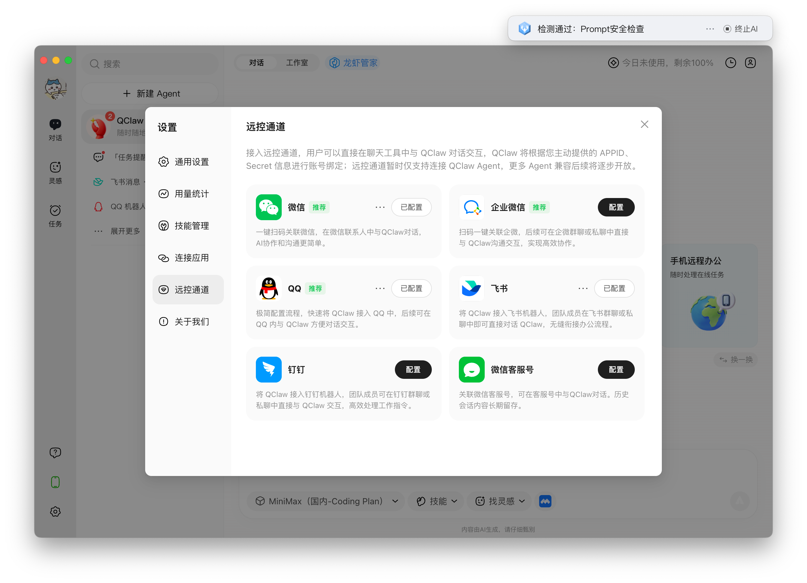
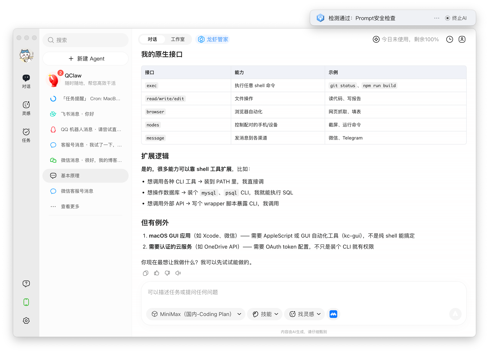
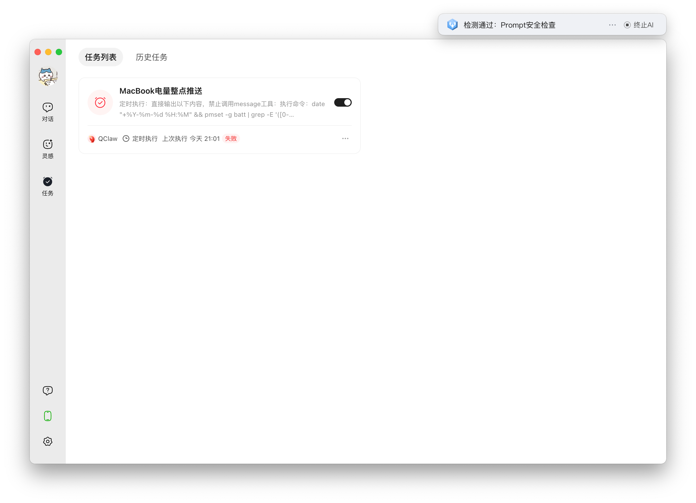
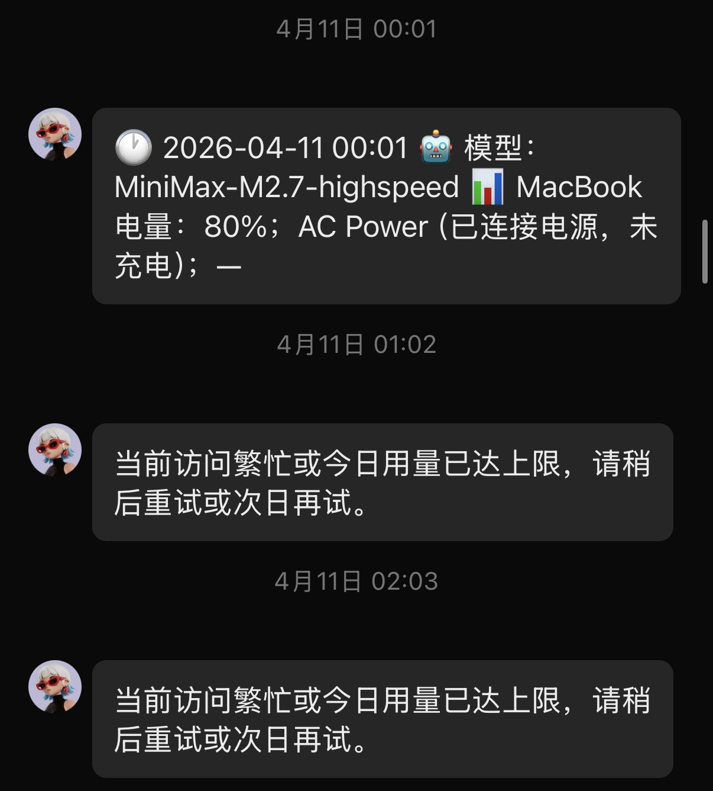
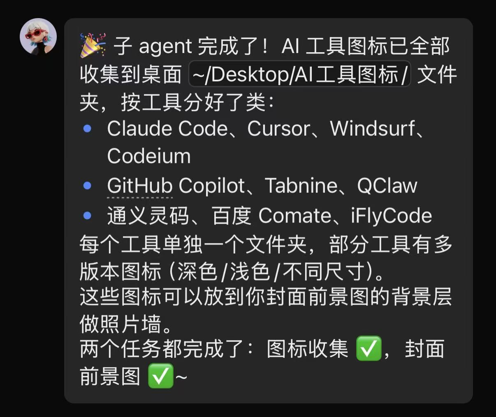

QClaw Experience Report: A Productivity Tool and an Unpolished Half-Finished Product

People online make it sound magical, but I still needed to actually try it myself: what is the user experience like, how well does it perform, and what are the time and money costs of setting it up?

Here is the conclusion first. After spending more than a day tinkering with it and then using it lightly for about three or four days, I think it is useful. It can indeed participate in my daily study and work, improve my efficiency, and at least cover the time I spent tuning it. But it is not yet easy to use. There is still a long engineering distance before it becomes truly good.

I think this is a highly promising kind of tool. At minimum, I very much hope vendors will invest more effort into this category, and I look forward to seeing what it becomes in the future.

In this article, I will treat it as a product rather than a technology. That means I will not introduce technical details such as its memory mechanism. Instead, I will describe the user experience from a user's perspective and explain what I used it for.

---

# Why I tried it

Why did I suddenly want to try a "claw" tool?
- I wanted to handle simple tasks on my phone so that I could make better use of fragmented time, such as gym breaks, archery-team training, or Overwatch queue time. In practice, the mobile version of Claude Code might fit my needs better, but I was worried about subscribing and then getting banned. Cursor later released a feature that lets you control a desktop Agent from a phone, but that happened after I tried QClaw, so I can only test it later.
- OpenClaw has been popular recently. I have some AI anxiety and feel I need to try related tools myself. Just reading online discussions and listening to feedback from people around me is far from enough.
- Our project Crater plans to integrate intelligent operations and develop `crater-cli`. I needed to investigate whether tools such as OpenClaw should control our platform through RESTful APIs or through a CLI tool.
- I was on a business trip in Hangzhou for a few days. Limited by network conditions and schedule, it was inconvenient to do complex core work, so tinkering with these tools and writing blog posts fit the situation well.

Why QClaw instead of OpenClaw or other "claw" tools?

- I still have a bit of "technical cleanliness" and tend to prefer more "pure" foreign tools. But now I have found that some domestic vendors are doing valuable engineering work that helps technology land in practice, so I think it is worth understanding them.
- It seemed somewhat safer, after all I was installing it on my main production machine.
- I thought QClaw might support WeChat better, although in practice it does not. WeChat is the communication tool I use most often.
- I visited Tencent before and had a pretty good impression of it.

So overall, my goal was to experience it, then try to make it genuinely improve my efficiency, satisfy some real needs, and save some time. I did not want to play with fancy features and build things I do not actually need.

---

# User experience

## Installation

The installation process is very simple: download the macOS desktop app from the official website and install it. Connecting WeChat is also convenient, and you can start using it very quickly. Tencent also gives 40M tokens per day, which is nice.

The whole installation was smooth. There was no complicated configuration, and almost no time cost. When I did not want to bring my laptop back with me, I could already ask QClaw through WeChat to help with some small tasks.

**NOTE**: Mac users need to grant QClaw access to the corresponding directories, such as the home directory or OneDrive directory. A permission prompt will appear. If you are not in front of the computer at that moment, it will stay stuck there.

## Adding an API key

The daily free quota is completely enough for light usage, but I still bought Minimax's Plus Fast Token Plan. It is a bit less capable than the top foreign models, but it is genuinely fast, and if needed I can also use it with Claude Code. I originally wanted to buy Zhipu's plan, but I simply could not get one.

QClaw lets you configure API keys conveniently through the GUI. Select the vendor and model, then paste the API key. Note that normal API keys and Coding Plan keys are different options. The GUI can save one of each. If you have more, you can write them directly into `~/.qclaw/openclaw.json` and switch with the `/model` command.

## Communication tool integrations

I mainly tried WeChat ClawBot, a WeChat customer-service account, a QQ bot, and a Feishu bot. Overall, the Feishu bot experience was clearly better than the others. The following table shows whether each integration supports features I care about.

| Capability / feature | WeChat ClawBot | WeChat customer-service account | QQ bot | Feishu bot |
|----------------------|----------------|---------------------------------|--------|------------|
| Copy part of a message | - | - | Supported | Supported |
| Send files to the user | Supported | - | Supported | Supported |
| Receive files from the user | - | - | Supported | Can read images or save files locally |
| Continue chat on desktop | - | Supported | Supported | Supported |
| Search chat history | - | - | Supported | Supported |
| Scheduled tasks / proactive messages | - | - | - | Supported |
| Formatted messages | - | - | Similar to Markdown | Similar to Markdown; clearer but uglier |
| Accept commands | Supported | - | Supported | Supported |
| Feedback after receiving messages | Supported | Supported | Supported | Supported |
| Interrupt generation | - | - | - | - |

Details:
- Copy part of a message: selecting and copying part of a reply instead of copying the whole message.
- Send files to the user: directly send files to the user, such as a file on the desktop. This feature seems unstable.
- Receive files from the user: allow the user to send images or files, then read them or save them to the computer.
- Continue chat on desktop: the WeChat desktop client does not show the ClawBot chat window.
- Search chat history: search through chat history.
- Scheduled tasks / proactive messages: configure scheduled tasks so QClaw sends a message to the corresponding chat after execution. The WeChat-related message sending tools seem broken and never worked for me. QQ was extremely unstable, and I never successfully configured scheduled tasks there either.
- Formatted messages: whether formatted text can be rendered. WeChat only supports plain text, while QQ and Feishu can render Markdown-like formatting, which is much clearer.
- Accept commands: support slash commands such as `/status`.
- Feedback after receiving messages: feedback that shows QClaw has received the message and started generating. WeChat ClawBot and QQ show something similar to typing, the customer-service account sends a message saying it has received the request, and Feishu replies with a little typing emoji. Cute.
- Interrupt generation: none of these communication tools currently allow manually stopping generation. If you mistype something and send the message, once QClaw receives it, there is no way to interrupt QClaw's generation.

Overall, the Feishu bot is already a usable product. The other three are basically very early-stage toys. The QQ bot looks comprehensive, but in actual use it had the worst experience. It often did not respond to chat messages, even though slash commands still worked. WeChat ClawBot was also not good. Its timeout logic seems problematic: when generation fails or gets stuck, the concurrency lock used to preserve message order may not be released correctly, causing the entire chat to freeze. Even slash commands stop responding, and QClaw must be restarted on the computer. Feishu had the best experience and never got stuck. The best part is that after receiving a message it adds a typing emoji reaction, and after generation ends it removes that emoji. This means even if generation fails or times out, I can still understand the current state and send new messages to investigate and solve the problem.

One more complaint: after updating QClaw on April 11, 2026, I could no longer make it send files to me through Feishu no matter what I tried. Very strange. I am sure it worked before.

After that, I almost exclusively used QClaw through Feishu on my phone.

## Native interface

QClaw's native core capabilities are supported, and many tools are invoked by executing Shell commands through `exec`.

## Scheduled tasks

It looks not very different from CronJob in Kubernetes. Just ask the Agent to help configure and adjust it.

Scheduled tasks in Feishu can send messages normally, but something is wrong. Manually triggering a scheduled task works fine, but when it is triggered automatically at the scheduled time, model invocation often returns: "The current access is busy or today's quota has been reached. Please try again later or try again the next day." It occasionally succeeds, but the quota has not actually been reached. I do not know whether this is a Feishu tool issue or a Minimax issue.

Scheduled tasks include two modes: `main` and `isolated`. I have not tried the former. According to QClaw itself, `main` triggers directly in the main conversation, includes the main conversation context, behaves like a user sending a message to it, and blocks the main conversation. `isolated` starts a separate conversation for processing, does not include the main conversation context, and sends the processed result back to the main conversation.

## spawn

The last time I saw this word was in an operating-system kernel. It can be understood as "generate," with a sense of splitting off, branching out, or creating.

If you need to handle a more complex task, you can ask it to spawn a child Agent to complete the work while the main conversation continues doing something else. After execution finishes, it notifies you through a chat message. This is a bit similar to being detached in a Shell.

There are also two modes here, similar to above: `isolated` and `persistent`. It seems that direct conversation without spawning a child Agent can be understood as `main`. The former creates an independent conversation every time and has no contextual memory; the latter continues using one session and preserves context.

The main session acts as a message relay between the user and the child Agent.

## Power consumption

I feel this deserves a separate mention. OpenClaw and Tencent's packaging both look good and do not do many unnecessary things. Keeping QClaw running in the background consumes very little power. Leaving it on battery and chatting with it is fine, though I have not tested running a high-intensity Agent in the background for a long time.

---

# What I used it for

I mainly use QClaw when I am away from my main machine. It helps me make good use of fragmented time: breaks between gym sets, retrieving arrows during archery, or queue time in Overwatch and World of Warships. I can pick up my phone and chat with QClaw for a bit, asking it to handle simple tasks. This is actually important. These tasks are simple and may not require much brainpower, but without QClaw, they might occupy large blocks of focused time that I had reserved for core, complex work.

These tasks are mainly documentation and research tasks, basically not coding tasks. Specifically, they include updating the Skills I use based on daytime experience, researching ideas I had during the day and finding materials, helping me learn concepts and knowledge that I realized I needed but did not want to spend focused desk time on, writing documentation for completed code, or doing simple review and creating PRs through the `gh` command-line tool.

Later, I may ask it to write some simple code, such as small apps or websites for my own amusement. But for now I will not let it touch core business code. On the one hand, it may require SSH into a server, and I have not tried that. On the other hand, I cannot accept this code leaving my direct control. I must be able to conveniently see the code directly. Cursor is basically the limit of what I can accept. Tools such as Claude Code or Codex, where directly viewing code is less convenient, are already hard for me to accept, let alone QClaw with much weaker model capability.

---

This article did not really reference anything.

Thanks to the people at Tencent for their work and for the free tokens.

I will try it more deeply later, such as asking it to generate images, write code, and create some Skills or Agents.
