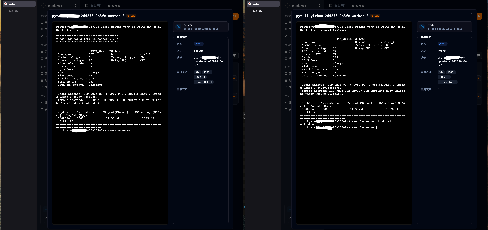
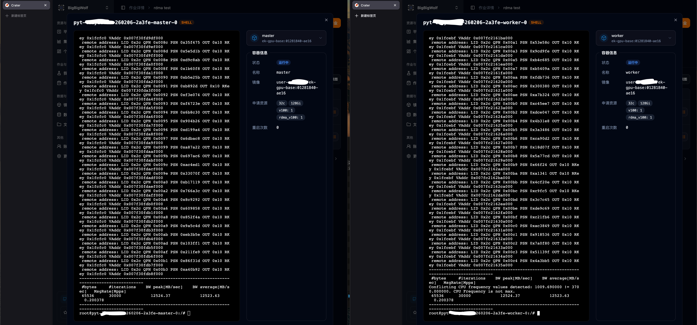
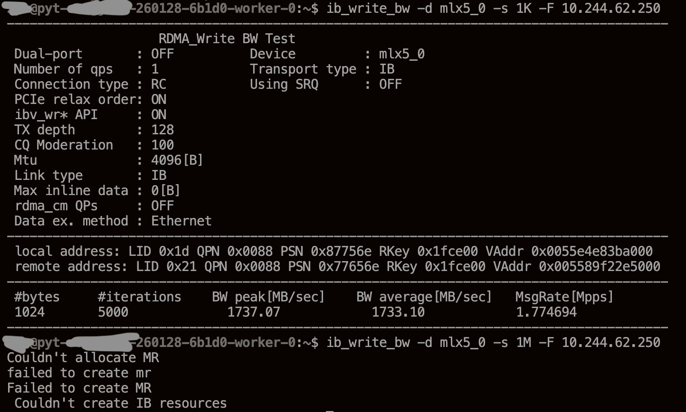

Raising the Pod Memory Lock Limit for RDMA in a K8s-containerd Environment

# Final solution

To save time, I will put the final solution that worked first.

The core of this solution is modifying the **OCI Runtime Specification**. In the context of containerd, the JSON file specified by the `base_runtime_spec` parameter is treated as the container's **base specification template**. It is the final source of truth for container resource boundaries such as the `memlock` limit. See the [OCI configuration specification](https://github.com/opencontainers/runtime-spec/blob/main/config.md#posix-process). The underlying OCI runtime, such as runc, strictly follows this blueprint and initializes the container process resource limits through the `setrlimit` system call.

## Export and modify the existing configuration

Because containerd does not automatically merge this parameter with the system default configuration, but instead uses a complete replacement strategy, we must first export a template that contains the full current system definition and then make small adjustments based on it. Run the following commands on the node.

```shell
ctr oci spec > /etc/containerd/rdma-spec.json
vim /etc/containerd/rdma-spec.json
```

Modify the following part of the configuration file by appending `RLIMIT_MEMLOCK` to the `rlimits` array:

```json
        "rlimits": [
            {
                "type": "RLIMIT_NOFILE",
                "hard": 1024,
                "soft": 1024
            },
            {
                "type": "RLIMIT_MEMLOCK",
                "hard": 18446744073709551615,
                "soft": 18446744073709551615
            }
        ],
```

## Reference the modified configuration

Modify the containerd configuration.

```toml
      [plugins."io.containerd.grpc.v1.cri".containerd.runtimes]

        [plugins."io.containerd.grpc.v1.cri".containerd.runtimes.nvidia]
          # Change this to the absolute path of the JSON template above
          base_runtime_spec = "/etc/containerd/rdma-spec.json"
          cni_conf_dir = ""
          cni_max_conf_num = 0
          container_annotations = []
          pod_annotations = []
          privileged_without_host_devices = false
          privileged_without_host_devices_all_devices_allowed = false
          runtime_engine = ""
          runtime_path = ""
          runtime_root = ""
          runtime_type = "io.containerd.runc.v2"
          sandbox_mode = "podsandbox"
          snapshotter = ""
```

Adjust this according to your actual environment. The goal is to make the corresponding Pods successfully apply the configuration.

> After modifying the container runtime configuration and restarting the service, **already-running Pods are not affected**. You must manually delete the old Pods so that Kubernetes reschedules them and triggers containerd to initialize them with the new OCI blueprint. Only then will the configuration really take effect.

## Remove containerd's own limit, optionally

For containerd managed by systemd, you can make this change as follows.

```shell
EDITOR=vim systemctl edit containerd
```

Add the following content to the daemon configuration.

```toml
[Service]
LimitMEMLOCK=infinity
```

Then restart the service with `systemctl restart containerd`.

In testing, because containerd has the `CAP_SYS_RESOURCE` capability, modifying only the OCI blueprint was enough to remove the Pod memory lock limit. Still, completing this setting improves the robustness of the daemon itself, so I recommend enabling it as a production best practice.

## Testing

At this point, the memory lock limit inside the Pod should have been removed. We can run the RDMA bandwidth test again and see the following output on the master and worker.



**Master:**

```
root@pyt-***-260206-2a3fe-master-0:/# ib_write_bw -s 1M -d mlx5_0 -F
************************************
* Waiting for client to connect... *
************************************
---------------------------------------------------------------------------------------
                    RDMA_Write BW Test
 Dual-port       : OFF          Device         : mlx5_0
 Number of qps   : 1            Transport type : IB
 Connection type : RC           Using SRQ      : OFF
 PCIe relax order: ON
 ibv_wr* API     : ON
 TX depth        : 128
 CQ Moderation   : 1
 Mtu             : 4096[B]
 Link type       : IB
 Max inline data : 0[B]
 rdma_cm QPs     : OFF
 Data ex. method : Ethernet
---------------------------------------------------------------------------------------
 local address: LID 0x2c QPN 0x0087 PSN 0xcc6a4c RKey 0x1fcc bd VAddr 0x037f67d3b5030
 remote address: LID 0x2c QPN 0x0088 PSN 0x6dc93a RKey 0x1fcf be VAddr 0x037f026db4030
---------------------------------------------------------------------------------------
 #bytes     #iterations    BW peak[MB/sec]    BW average[MB/sec]   MsgRate[Mpps]
 1048576    5000             11133.60            11129.09           0.011123
---------------------------------------------------------------------------------------
```

**Worker:**

```
root@pyt-***-260206-2a3fe-worker-0:/# ib_write_bw -s 1M -d mlx5_0 -F 10.244.44.139
---------------------------------------------------------------------------------------
                    RDMA_Write BW Test
 Dual-port       : OFF          Device         : mlx5_0
 Number of qps   : 1            Transport type : IB
 Connection type : RC           Using SRQ      : OFF
 PCIe relax order: ON
 ibv_wr* API     : ON
 TX depth        : 128
 CQ Moderation   : 1
 Mtu             : 4096[B]
 Link type       : IB
 Max inline data : 0[B]
 rdma_cm QPs     : OFF
 Data ex. method : Ethernet
---------------------------------------------------------------------------------------
 local address: LID 0x2c QPN 0x0088 PSN 0x6dc93a RKey 0x1fcf be VAddr 0x037f026db4030
 remote address: LID 0x2c QPN 0x0087 PSN 0xcc6a4c RKey 0x1fcc bd VAddr 0x037f67d3b5030
---------------------------------------------------------------------------------------
 #bytes     #iterations    BW peak[MB/sec]    BW average[MB/sec]   MsgRate[Mpps]
 1048576    5000             11133.60            11129.09           0.011123
---------------------------------------------------------------------------------------

root@pyt-***-260206-2a3fe-worker-0:/# ulimit -l
unlimited
```

The limit has been removed, and RDMA can now transmit larger amounts of data between Pods.



## Notes

This operation targets a single node. If many nodes need this configuration, it is better to automate the process with scripts instead of configuring each one manually.

Reinstalling containerd or performing similar operations may cause the configuration above to be lost. In that case, the process needs to be repeated.

---

# The problem

## Environment

The cluster and node software environment is as follows.

| Item | Version |
| --- | --- |
| Cluster Server Version | v1.34.3 |
| Node Kubelet version | v1.34.3 |
| Operating system | Ubuntu 22.04.5 LTS |
| Kernel version | 5.15.0-170-generic |
| containerd | 1.7.28 |

Note that after the initial operation, our project group upgraded the cluster Kubernetes version and node kernel version. After the upgrade, I repeated the operation above. The versions listed here are the post-upgrade versions.

In other words, this solution is also effective for slightly older versions. In addition, after upgrading the kernel, the related configuration may be lost. I suspect containerd was also reinstalled, so the relevant operation needs to be performed again on the node.

## Symptoms

Some project groups in our lab work on RDMA-related topics. When using our internal Crater cluster management platform, they found the following problem.

```
[host2] $ ib_read_bw -q 30 10.244.46.50
Couldn't allocate MR
failed to create mr
Failed to create MR
 Couldn't create IB resources
```

During RDMA bandwidth testing, small transfers such as 1024 bytes worked normally, but transfers of 1M and above failed. The error messages were similar to the above. See [Issue #339](https://github.com/raids-lab/crater/issues/339).



Checking the limit directly with `ulimit -l` showed 64 KB, which is the system default memory lock limit.

At this point, using `ulimit -l unlimited` inside the container or modifying `/etc/security/limits.conf` could not successfully change the memory lock limit.

The following error during a connectivity test was caused by the same issue.

```
[host1] $ ib_read_bw -q 30

************************************
* Waiting for client to connect... *
************************************
---------------------------------------------------------------------------------------
                    RDMA_Read BW Test
 Dual-port       : OFF          Device         : mlx5_0
 Number of qps   : 30           Transport type : IB
 Connection type : RC           Using SRQ      : OFF
 PCIe relax order: ON
 ibv_wr* API     : ON
 CQ Moderation   : 1
 Mtu             : 4096[B]
 Link type       : IB
 Outstand reads  : 16
 rdma_cm QPs     : OFF
 Data ex. method : Ethernet
---------------------------------------------------------------------------------------
ethernet_read_keys: Couldn't read remote address
 Unable to read to socket/rdma_cm
Failed to exchange data between server and clients
```

## Analysis

The core of RDMA is allowing hardware, namely the NIC HCA, to directly access remote memory while bypassing the CPU. During normal operation, the operating system may perform paging or move data at any time to optimize memory usage, causing the physical address corresponding to a virtual address to change. If the NIC is transferring data while the kernel swaps out or moves that memory page, the transfer may fail or even cause system errors.

Therefore, to guarantee absolute address stability, RDMA must perform **Memory Registration (MR)** before transmission. This operation locks the specified virtual memory pages into physical memory at the kernel level and prevents the kernel from moving them or swapping them to disk.

Crater already grants jobs `CAP_IPC_LOCK`, allowing them to perform memory locking operations, but it does not change the allowed amount that may be locked. At the same time, because the container is not granted `CAP_SYS_RESOURCE`, operations inside the container cannot raise this upper limit.

Currently, Kubernetes officially does not provide a direct rlimit configuration field in the Pod Spec. See [Kubernetes Issue #3595](https://github.com/kubernetes/kubernetes/issues/3595). Therefore, we need to approach the problem from the container runtime side.

> Users do need this feature, but Kubernetes and containerd both seem to consider it outside their scope, which has left us without an elegant solution.
> Ideally, we would like to pass a parameter directly when creating the Pod to solve the rlimit problem.
> Another thing worth looking forward to is that the Kubernetes community has formally started discussing native support for Pod-level rlimit configuration in the v1.36 cycle. See [KEP-5758](https://github.com/kubernetes/enhancements/pull/5762).

The dockerd runtime provides the corresponding configuration item, `default-ulimits`, making it relatively convenient to configure this limit at the node level. See the [daemon configuration file reference](https://docs.docker.com/reference/cli/dockerd/#daemon-configuration-file) and the [resource constraints guide](https://docs.docker.com/engine/containers/resource_constraints/#set-default-ulimits-for-a-container).

However, our cluster currently uses containerd. It does not provide a configuration item similar to dockerd. See the [configuration file reference](https://github.com/containerd/containerd/blob/main/docs/cri/config.md). Developers also explicitly rejected daemon-level configuration in [Issue #3150](https://github.com/containerd/containerd/issues/3150). Therefore, we had to find another way to solve the problem.

This led to the idea of solving the issue through OCI.

---

# Pitfalls and exploration

After verification, the following approaches are invalid in our environment.

1. Running `ulimit -l unlimited` directly inside the Pod, or modifying `/etc/security/limits.conf` and logging in again, cannot directly change the memory lock limit. The suspected reason is that the Pod does not have `CAP_SYS_RESOURCE` and cannot break through the preset upper limit.
2. Directly modifying `/etc/security/limits.conf` on the host node where the Pod will be scheduled, or only setting `LimitMEMLOCK=infinity` for the host container runtime daemon, is not enough. The suspected reason is that the container executor runc strictly follows the OCI specification blueprint and executes the `setrlimit` system call for the container during startup. This forcibly overwrites, usually lowers, the container's limit to the default value in the blueprint, such as 64 KB here.
3. The current version of Kubernetes does not provide a field in the Pod or container API that can directly set rlimit, so the platform cannot directly relax this limit when creating the corresponding Pod.

---

In this article, rlimit refers to a category of resource limits imposed by the operating system on each process. In system interfaces and container runtime configuration, these often appear as `RLIMIT_*` and `setrlimit`. `ulimit` is a Shell built-in command used to view or attempt to adjust these limits on the current shell process. They correspond to the same underlying mechanism, but strictly speaking they are not the same concept. The memory lock limit adjusted in this article corresponds to `RLIMIT_MEMLOCK`, one of these resource limits.

Besides trying many ineffective methods found online, today's AI also showed very severe hallucinations when solving this problem. For example, it assumed containerd had a configuration item similar to dockerd, which led me into many pitfalls.

The reference links are attached at the corresponding places in the article. In addition, for earlier RDMA configuration, you can refer to [my senior student's blog](https://zhuanlan.zhihu.com/p/1897271506645530541) and [our platform documentation](https://raids-lab.github.io/crater/zh/docs/admin/more/rdma/).
