Many Problems, Thoughts, and Decisions in Building a CLI Tool for a Web Platform

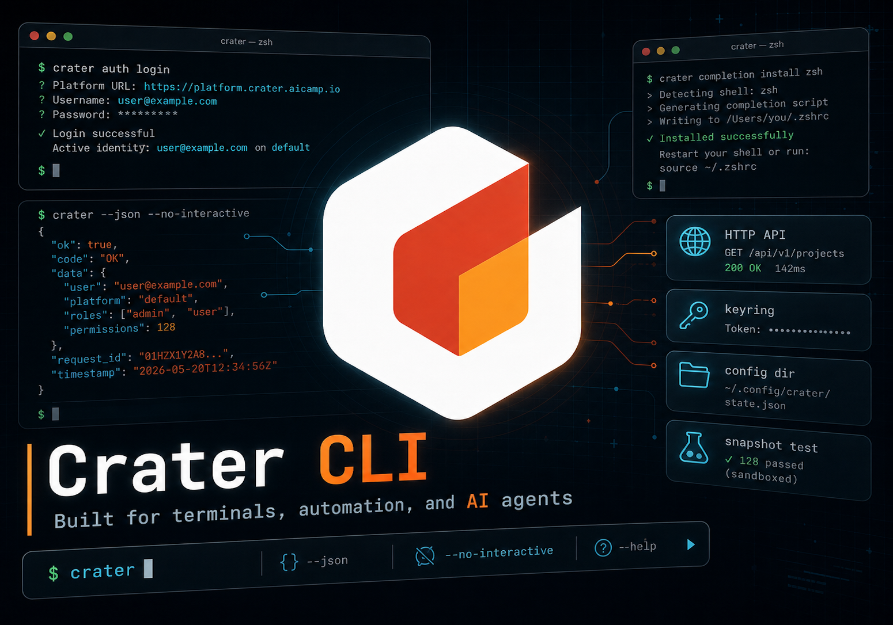

Recently I have been developing a [CLI tool](https://github.com/raids-lab/crater/tree/main/cli) for our [Crater platform](https://github.com/raids-lab/crater). In the current vibe-coding era, it is easy to use AI to quickly produce a usable tool. But as a student, I still want to make it better: at least learn something, accumulate experience, and distill some thoughts, instead of merely handing over a product to the people who need it.

Of course, we cannot consider everything from the beginning or design an architecture that is elegant in every way. But at least we can think through the problems we have noticed, do our best on them, and avoid overengineering.

Let me introduce the background first. This platform is an accelerator-cluster management platform with both web frontend and backend. It lets users, mainly AI researchers, quickly use the computing accelerator hardware in the cluster to run training or inference and support their research. Users now have a need to operate the platform through Agents or script common operations, which can significantly improve their productivity.

Against this background, we plan to develop a CLI tool. On the one hand, it lets Agents use the platform directly. On the other hand, it serves students who are used to CLI tools or scripts. Therefore, while developing the CLI, we need to consider not only human friendliness but also AI friendliness.

From the system architecture perspective, this CLI tool sits at the same level as the frontend and connects to the web backend through HTTP APIs.

Some of the issues referenced the design of the [Feishu CLI](https://github.com/larksuite/cli). Thanks for that.

I just used 11 commits to build the basic CLI framework, although by the time this article is published, some time may have passed. The current changes are still limited to the CLI directory. I have not modified the backend or other parts just to prepare for the CLI.

This article summarizes and records the problems I have thought about so far.

It may be dry and hard to read. It is mainly written for experienced developers, so I will not expand basic concepts.

---

# Overall design

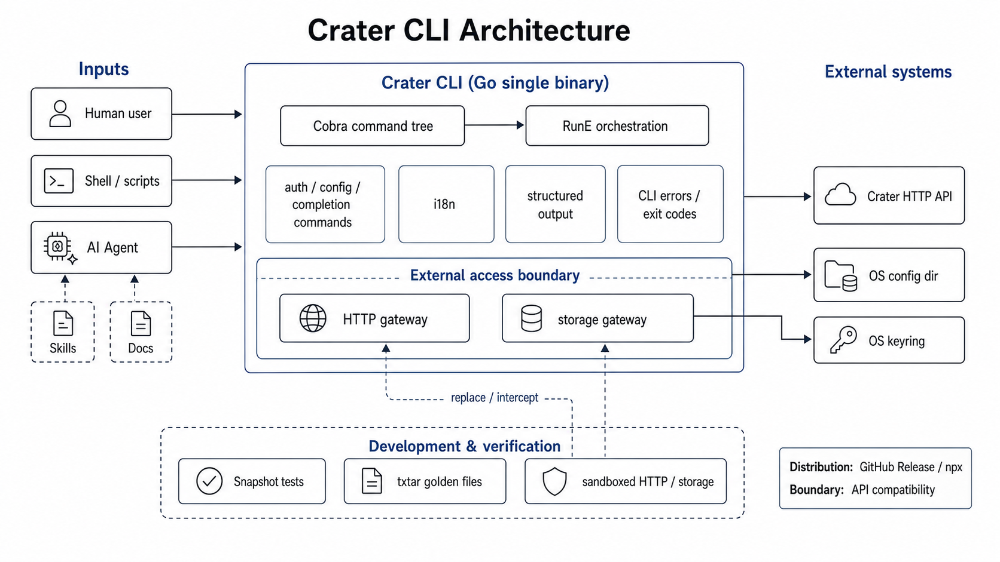

Here is the current architecture diagram, so readers can first get a general understanding. In the following sections, I will explain how the modules and design choices came about.

## Whether a separate repository is needed

Crater is an open-source project with its own GitHub repository. The frontend, backend, documentation website, and Helm Charts are all placed as subdirectories in this repository, so putting the CLI tool in a subdirectory is quite natural.

The advantages of using a subdirectory are roughly:
- Easier version alignment, especially API version alignment.
- Centralized management and lower maintenance cost.
- Consistent with the current project organization.
- Easier reuse of existing tools in the main repository, such as the `pre-commit-check` script and GitHub Copilot code review instructions.

The disadvantages are roughly:
- PRs are more likely to conflict, and merge waiting time may be longer.
- Skills distribution is not as direct. The path is more complex and less clean-looking, although this has little actual impact. I will discuss it later.

Overall, putting the CLI in a subdirectory of the main repository instead of creating a separate repository is more beneficial than harmful for our current stage.

## Command organization

This is not something we can take for granted. We need to carefully design the command structure of Crater CLI: how to organize subcommands, command groups, and arguments. It needs to match the thinking and usage habits of both human users and AI, and it also needs to make the ownership of commands in the code easy and elegant to organize.

Based on my experience using various CLI tools, there are roughly three main ways to organize commands:

- Verb first: for example, `kubectl`. Say the action first, such as `get`, `describe`, or `apply`, and then the resource type and object.
- **Noun first**: for example, `docker container` and `docker image`. Say what kind of object is being operated on first, and use the next level for the specific action, such as `ls` or `rm`.
- Mixed: for example, `git`. The top level includes verb-like commands such as `clone`, `pull`, and `commit`, as well as noun-like commands such as `branch` and `remote`. At first glance, it has more verb-like entries and is closer to verb-first. It can also be understood as compressing or omitting many common noun levels, such as `code` and `staged`, so the noun dimension is relatively restrained.

For Crater CLI, the platform itself divides resources and entities into many modules, such as resource management, job management, account management, image management, statistics, and so on. Here, account is a representation or abstraction of a resource scheduling and allocation queue. The backend code is also organized by module. This naturally fits a noun-first command organization.

For source-code management and Agent Skills development, noun-first does not have obvious disadvantages. It even aligns better with module boundaries, so this is the final choice.

On top of that, it would still be best to provide shortcuts for some commonly used commands, such as `docker ps`, which is a shortcut for `docker container ls`.

## Documentation-driven development

Crater CLI is a subproject born in the vibe-coding era. I do not believe its code will be written entirely by humans by hand. Therefore, from the beginning, it should be shaped for AI development. We should assume that the human developer controlling the AI is not familiar with the CLI architecture and may not even have read the project code.

We need a mechanism that, under this background, ensures the code written by AI conforms to the architecture design and project constraints, instead of merely implementing a certain feature. We also need to lower the requirements on developers as much as possible. They should not need to be familiar with the CLI code architecture, have high technical standards, or use a specified AI tool. We only require them to follow the most basic development process.

Many AI tools now support repository-level or directory-level rules and prompts, but the industry does not have a unified format. Maintaining one set of prompts for each tool would be costly and prone to drift. A more robust approach is to solidify the process through Skills. I am also preparing to add a set of development Skills for the entire project, not just the CLI.

However, early in the project, conventions and constraints may iterate quickly, so putting all of them into Skills does not seem appropriate. Some documents also need to be read by human developers, which makes putting them inside Skills even less suitable.

After weighing the options, I decided to design the CLI around documentation-driven development. A few core documents control the entire AI development process. Specifically, they include architecture, specification, command, and review documents. All except the review document have been implemented, and I will add the review document later. Development Skills and PR review instructions will require reading the corresponding documents.

Specifically, these documents carry the following responsibilities:
- Architecture: explains the core architecture design of the CLI and the reasons behind it, the responsibilities of each module and code area, helps human developers understand the project, and helps AI understand the deeper intent and design behind the rules it needs to follow.
- Specification: explains the standard CLI development process and conventions, making it easier for AI to complete changes quickly and with high quality.
- Command: specifies command functionality, arguments, behavior, error handling, and boundary conditions in detail, making it easier for human developers, AI, and reviewers to align on code behavior. In every commit, this document must stay consistent with the actual code.
- Review: defines the review process for CLI code and documentation updates, making it easier for AI tools, human reviewers, and natural-language-driven review mechanisms to check changes under the CLI directory.

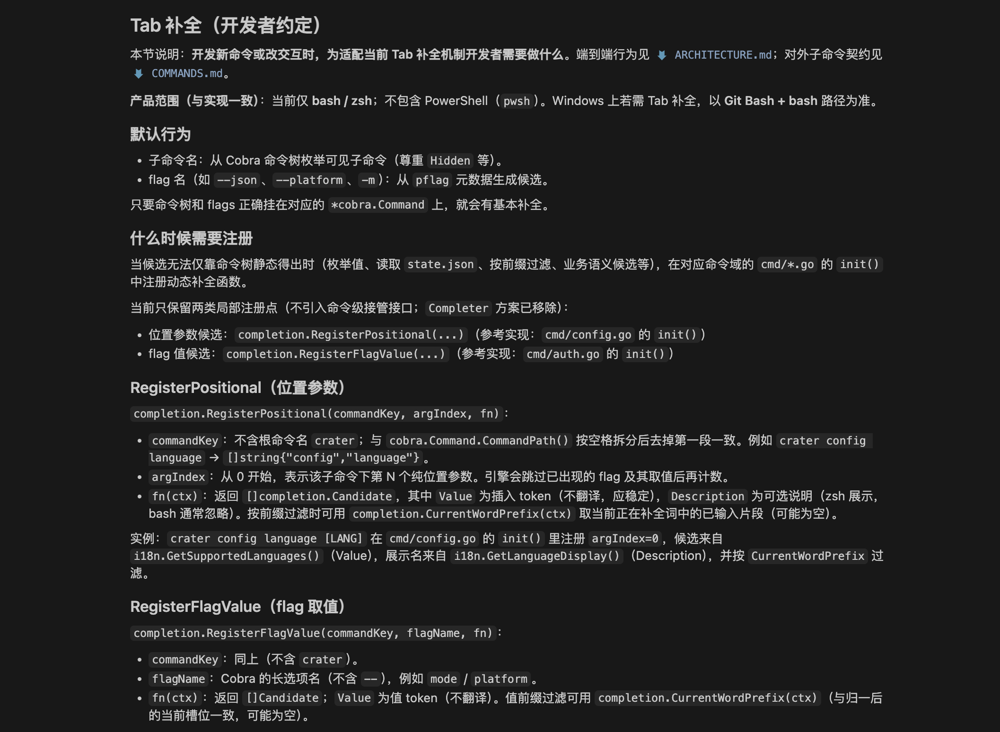

For example, the screenshot above shows part of the specification document. These documents should stay synchronized with code evolution at all times.

---

# Build and distribution

## Programming language

Which programming language should we use?

- **Go**: compiles into a single binary, has zero runtime dependencies, supports one-command cross-compilation, has good performance and fast startup, has a mature CLI ecosystem such as Cobra and Viper, has a gentle learning curve, and the project backend already uses Go.
- Rust: single binary, zero runtime dependencies, extreme performance, many benchmark CLI tools such as ripgrep and fd, type safety, but with a steep learning curve and long compile times. Binary size depends on dependencies and linking strategy, so it is not always smaller or larger than Go.
- TypeScript / Node.js: same language as the frontend, can reuse type definitions, has a rich npm ecosystem, but requires users to install a Node runtime first, and bundled output is large, often dozens of MB.
- Python: good CLI ecosystem such as click and Typer, but requires a Python runtime, and packaging it into an executable is simply painful.

Thanks to many ready-made TUI component libraries, TypeScript is now widely used in TUI programs such as Claude Code and OpenCode. But it is not fully suitable for Crater CLI. We do not have such complex frontend interaction requirements. For our scenario, this may even be a negative optimization. A single Go executable gives users a more worry-free experience, so we chose Go.

## Distribution (ToDo)

The users mainly use macOS, Linux, and Windows. How should we distribute this CLI tool? It needs to be easy for users to install while not adding too much maintenance cost.

The main options are:
- **npx-style one-line installation**: similar to Codex and Feishu CLI. Installation can be completed with a single npx command such as `npm install -g @larksuite/cli`. For users, this requires npx to be installed, which is basically common in the AI era. For developers, it requires registering an [npmjs](https://www.npmjs.com/) account and publishing the package, which is also convenient.
- **GitHub Release download**: users download the binary executable directly from the GitHub web page. We need to distinguish GitHub Packages from GitHub Releases here. The former is mainly used for packages, images, and so on, which is how we currently publish frontend and backend images for Kubernetes to pull. The latter is for publishing executable files and attachments that users can download through a browser. For users, this requires visiting GitHub and choosing the download for their platform. For developers, it only requires uploading artifacts to a Release in the workflow, similar to how we now push images to Packages.
- Package managers: such as Homebrew or even apt. These are convenient for users, but if using official sources, review and maintenance on the developer side are more troublesome.

The plan is to provide the first two methods first: distribution through npx and GitHub Releases.

## Updates and version management (ToDo)

At the beginning, do not make this too complicated. Leave distribution and versioning to existing mature tools. Crater CLI itself will not implement self-update for now. Even if we wanted to do it, network environment issues would make it troublesome for the program to fetch version information from GitHub by itself.

Thinking more carefully, version management still has many pitfalls, especially around GitHub Releases and the API version issues mentioned later. A Release must be attached to a tag, and the tag points to a specific commit. A tag should not be moved frequently, while the latest commit on the main branch keeps advancing. This makes it hard to release CLI versions both elegantly and frequently. This needs a separate plan aligned within the team. We need to smooth out the process, and if necessary, refactor and standardize the main repository. It may even deserve another article. The second half of this article will only slightly expand on part of it and will not promise a complete answer.

---

# State and storage

We need to think about how to cache user data, such as access tokens, in a way similar to browser cache.

The CLI process itself is stateless: every command is an independent run. Without external persistence, the CLI cannot keep state in memory long-term, nor can it remember the result left by the previous command.

Once persistence is needed, we almost inevitably run into the questions of where to store data and how to store it, which means cross-platform differences cannot be avoided.

Based on this, there are several questions and thoughts.

## User data cache

Crater itself is stateful by design. For the same currently logged-in user, we need to record the active identity, such as normal user or administrator, the active account, which is a representation or abstraction of a resource scheduling and allocation queue, and some basic user information. These all need to be sent to the backend with requests.

It is impossible to ask the CLI to log in again and reselect identity and account for every command, so this information must be persisted locally.

The storage system is a great place to store this information, but we need to handle path and parsing differences across platforms. The Go `os` package provides the `os.UserConfigDir()` function to obtain the configuration directory while handling platform differences. Crater CLI can then store the data it needs there.

Other CLI settings such as language can also be placed in the same configuration directory.

## Saving access tokens

Unlike ordinary state or cache data, these data may need encryption. Although we currently use the same token as the web side and can obtain it directly from browser cache, the CLI design still stores it encrypted.

Each operating system provides corresponding credential storage services, and sensitive data is kept and encrypted by these system components.

For Crater CLI, we only need to use the Go third-party package `github.com/99designs/keyring`, letting it act as an adapter layer to access credential storage features provided by different systems.

Crater CLI allows users to log in to a Crater site with multiple identities, or log in to multiple Crater sites, so it stores multiple credentials. Currently, the key is based on site, username, and login method.

## Login and authentication

The login flow also deserves separate thought.

Currently, the CLI uses the same approach as the frontend: transmitting the password in plaintext to the backend. It does not salt or hash the password before sending the request. In other words, the backend receives the user's actual password, although at least it does not store it in plaintext now.

This is not a good approach. At minimum, the backend should not be able to receive the user's plaintext password.

When logging in through the CLI, the user can enter the password interactively or provide it directly with the `--password` option. This implementation is even worse.

A better approach is to implement a more secure login interface on the backend. During frontend login, it could show a link or QR code, letting the user log in securely through various methods. The CLI would only ever obtain a token and would not touch the user's password.

We can consider this later, or leave some simple features to junior students. For now, I have not modified anything outside the `cli/` directory.

Another point to consider is that it may be best to include application information in the Header so the backend can determine whether a request comes from the CLI or the web frontend. This may currently be a pseudo-requirement, because no feature seems to need it, except possibly during CLI development, where we might use a whitelist to restrict CLI login.

---

# APIs and networking

All functionality of Crater CLI is built on top of the Crater backend HTTP API, so the CLI is tightly bound to it. This leads to several more questions and thoughts.

By the way, unfortunately, the current frontend and backend HTTP APIs are undergoing a large-scale refactor to make them conform to RESTful standards and form some Crater-specific conventions, such as certain business error codes, while also addressing technical debt from earlier non-standard development. This will have a huge impact on CLI development.

## API URL structure

Crater CLI should not only access deployed Crater services. It should also be able to connect to development versions running from source code. Such development versions may have different API URL structures or prefixes, so configuration support is best.

Currently, the API URL structure in Crater development and production environments is actually the same, but it is still better to organize them in a more elegant way.

Use a unified prefix and concatenate it with the path of each command to form the complete URL.

## Proxy issues

I noticed that many CLI tools show warnings when they detect a proxy, which made me pay attention to this issue.

Our lab's internal Crater service is deployed on the intranet. Users in other places on campus or off campus need to use Easy Connect to access it, and they usually also need proxy software for external network access. Although this is not exactly something Crater CLI should solve, as developers we need to ensure Crater CLI can run in this environment.

The CLI uses `github.com/imroc/req/v3` to construct the HTTP client. Its underlying Transport sets `Proxy` to the standard library's `http.ProxyFromEnvironment` when created, so its behavior is consistent with `net/http`: it follows environment variables such as `HTTPS_PROXY`.

Based on my tests on macOS, it works normally in a proxy environment, so I will not complicate it further.

There is no plan to provide a feature where users manually enter a proxy host and port for the CLI to connect through.

## API version management (ToDo)

Not only API version management, but Crater's overall version management also needs improvement. At the moment, there is only one formal version, `v1.0.0`.

Let us first discuss API version management.

CLI operation depends on HTTP APIs. If the version changes and a certain interface changes or disappears, the CLI may fail to execute and produce strange errors. The version of Crater deployed by a cluster administrator is very likely to differ from the version of Crater CLI installed by the user. The cluster might pull latest every day, or update the cluster to the previous version whenever a new Minor version is released. In contrast, a user's own installed Crater CLI may not be updated for eight years, exaggerated but possible.

This creates a conflict: version mismatch is very likely.

Handling this compatibility is a system engineering problem. It involves code implementation, development constraints, and many other aspects. Thinking roughly, it may include:
- CLI client development rules: for example, allow unknown response fields and avoid strict checks, so API responses can add new fields without breaking clients.
- API development rules: do not delete, only add, or even avoid modifying. When modifying interfaces, consider compatibility with old-version requests. If necessary, directly add a v2 endpoint and keep the original endpoint for old clients.
- Version handshake: provide a feature for the client and backend to perform a version handshake, allowing the backend to determine whether there may be API incompatibility. Implementing this is necessary, but it creates even more problems.
- API friendliness for different consumers: besides the frontend and CLI, this API has other consumers, such as an intelligent operations and AI assistant feature currently being developed as an undergraduate graduation project. Different interfaces are friendly to different consumers to different degrees. Some may be poorly designed and return a formatted JSON response tens of thousands of lines long. The frontend may accept that, but it is very unfriendly to a CLI that may need to expose the full response directly.
- Supporting both pre-refactor and post-refactor APIs: as mentioned above, the current API is still being normalized and refactored gradually. This means the CLI needs to support both old and new APIs for a period of time.

This may look strange, but in reality it is about solving all kinds of intertwined engineering problems. Facing real user needs and accumulating experience solving these problems is exactly the value of these projects.

The `v1.0.0` shown here is the version number injected by a tag-triggered build. But builds triggered by later main-branch updates cannot yet recognize that they are some version after `v1.0.0`.

Unfortunately, we do not yet have a complete solution. After the API refactor PR is updated, we need to find time to design such a solution and discuss it in a team meeting.

## Access control (ToDo)

The CLI tool has another issue: it greatly reduces the time cost for users to submit jobs or request resources.

Some users currently have many tasks to run. When they cannot get cards, they may create dozens of jobs to queue or vent. With a CLI tool, it becomes very easy to submit thousands of requests within one second.

Although we have added admission control to the job queue to limit the maximum number of jobs a user can submit, frequent network requests will still affect everyone's experience. This situation may be extreme, but out of responsibility to users, it is best to avoid it at the CLI level.

Perhaps we can record the user's last operation time, or the times of the last few operations, and limit the CLI operation frequency. Or more simply, add a one-second delay to job submission operations and use some lock mechanism to prevent multiple CLI clients from running and sending requests at the same time.

---

# Testing

Crater originally did not really have automated tests. It only had some basic lint and build tests, but no unit tests that checked functionality. In the current world where everyone commonly writes code with AI, this seems insufficient. Functional correctness is basically built on developer quality and the capability of AI PR Review. For that topic, see [another article of mine](https://zhuanlan.zhihu.com/p/2037582638454682241).

Therefore, I think adding some automated testing mechanisms is very necessary. Ideally, they should achieve these goals:
- Try to ensure that AI-written features match expectations.
- Ensure that AI does not break old functionality when implementing new features.
- Make review easier for reviewers.

Based on this, here are some thoughts and designs around testing.

## Unit tests

This is the most basic kind of test in Go, and Go provides good support and optimized experience for it.

We agree that when AI implements a feature, or after implementation, it should add unit tests for key and core functionality. These tests run before commit and in workflows to verify basic logic.

In this way, we can to some extent ensure that AI-written functionality meets expectations and does not break existing functionality.

## Snapshot tests and test sandbox

The unit tests above have the following characteristics:
- It is inconvenient to see what is tested: test cases are written in code, so human developers and reviewers cannot easily inspect what tests were performed or judge whether coverage is sufficient.
- It is inconvenient to see expected results: test outputs and results are not obvious, so human developers and reviewers cannot easily confirm whether the "expected result" set by AI matches their own expectations.
- They are not aligned with actual usage experience: unit tests mainly test internal logic, not actual command output, so they do not align with users' real usage scenarios.

Human developers and reviewers now rarely read AI-written code carefully. Against this background, and considering the characteristics above, I think unit tests alone are far from enough. They cannot guarantee that the product delivered to users matches requirements analysis and the development team's expectations.

Therefore, I plan to introduce and design a snapshot testing mechanism. Specifically, I have the following expectations and requirements:
- The actual command output and the command itself can be placed under version control and committed to the repository, making them directly inspectable in PRs.
- Developers can conveniently run the tests in their own development environments, generate snapshots for new commands, and check whether they broke snapshots for other commands.
- The tests can run in GitHub Workflow.
- The tests should not affect the actual user environment or production cluster.

But implementation still has many problems to solve:
- Different developers have inconsistent system environments. They may use different operating systems, choose different languages, and so on, which can make output unstable.
- The GitHub Workflow environment may differ from normal development environments.
- User login state and cluster state are unstable. For example, the output of an API that queries the current logged-in user information or queued job list is unstable across developers, time, and target clusters.
- There is currently no dedicated test cluster accessible from the Internet.

To solve these problems and meet our needs, we need to design a snapshot testing mechanism tailored to our scenario.

For our scenario, implementing an overly complete testing mechanism is unnecessary. We can sacrifice some use cases to simplify implementation. For example, we can avoid connecting to a real cluster to test actual network requests, mainly focus on failure cases, and check whether error handling logic is sufficiently robust.

After weighing the options, I designed and implemented an initial snapshot testing and sandbox mechanism.

Currently, Crater CLI mainly accesses the environment in the following ways:
- Reading environment variables.
- Reading and writing the filesystem, including the aforementioned Keyring and unencrypted data.
- Reading and writing network resources through HTTP APIs.

We keep environment variable reading, using it to control some CLI behavior, but provide isolation for filesystem and network resources.

Specifically, we provide fake implementations for filesystem reads/writes and network requests, controlled through environment variables. In the test environment, they avoid actually reading or writing filesystem and network resources. For filesystem reads, such as checking the currently logged-in user, they directly return fake data instead of calling related libraries to read the actual filesystem. For writes, they can return fake success, meaning they do nothing but treat the operation as successful. For network operations, they directly return network timeout or 404 Not Found. For key interfaces, we can also register fake implementations that return more realistic mock data.

From the implementation perspective, we need to narrow and centralize filesystem access and network requests, extract the tools or entry points for accessing filesystem and network, and constrain code to access both only through these interfaces. This avoids scattering such access throughout the code. Then we process these entry points and tools so they can read the corresponding environment variables or build parameters and use the sandbox filesystem and network implementations for simulation, instead of accessing the developer's or environment's actual filesystem and network.

At this point, we have an isolation mechanism. Next, we need to implement the snapshot mechanism.

Saved snapshot files need to satisfy:
- Human-readable, so human reviewers can inspect them easily.
- Easy to parse, so diff can determine whether the actual run result matches the old standard, known as the golden file.
- Clearly generated, so they do not create the misunderstanding that "I can manually modify or create this."

Of course, implementing our own file format and its parsing and editing tools could solve these problems well, but it is clearly unnecessary at this stage.

Using Markdown directly may create misunderstandings, such as causing unfamiliar developers to try to create or modify it manually. I found a suitable tool: `golang.org/x/tools/txtar` from the official toolchain. It can pack multiple small files into a single text file. With it, we can logically separate command stdout, stderr, exit code, and other information into multiple files that do not interfere with each other, making them easy to locate and inspect, while physically keeping them in one complete file that is human-readable. For example, here is a snapshot left by one test in a file.

```
-- en/01-missing-platform-nojson/argv --
crater auth login --no-interactive --username u --password p
-- en/01-missing-platform-nojson/exit --
2
-- en/01-missing-platform-nojson/stdout --
-- en/01-missing-platform-nojson/stderr --
Error:
  platform URL is required (--platform)
```

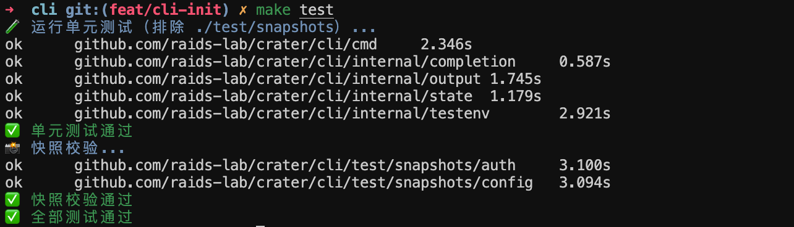

Of course, we also need supporting make targets, so stable snapshots of command execution can be kept in the repository.

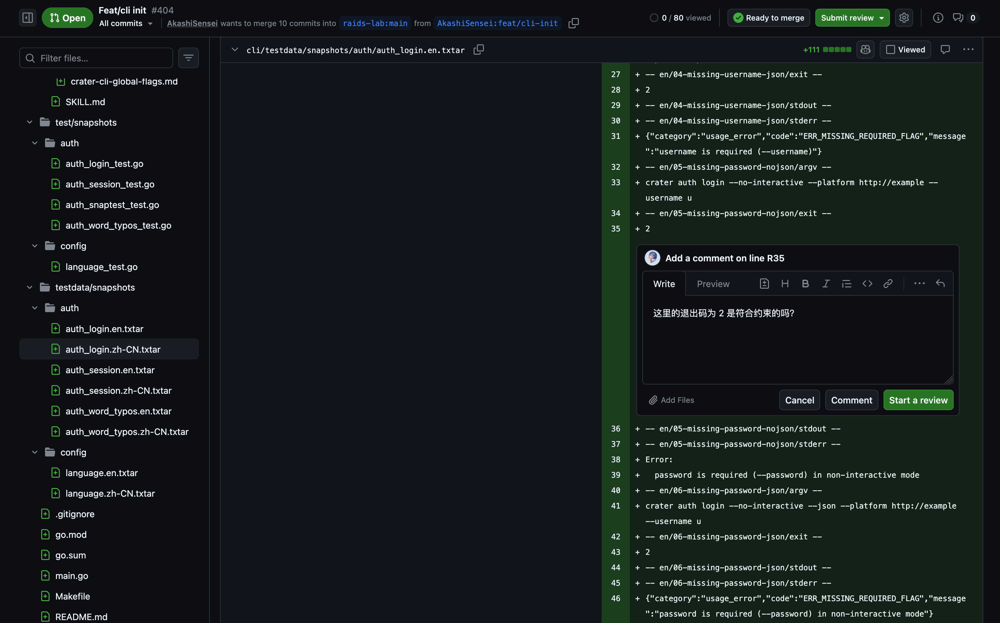

During review, reviewers can comment directly on command output, mainly error flows.

## AI review and testing (ToDo)

Besides code- and script-based automated testing, we can now also add AI-based tests guided by natural-language documents, or more simply, let AI help with testing directly.

The main Crater project previously had large-language-model-driven workflows, such as automatic documentation translation. This was implemented by deploying a large language model in our cluster and using self-hosted GitHub Runners. Perhaps we can use a similar approach to add an AI workflow for testing the CLI. But at the beginning, this does not feel necessary. We can first ask everyone to use their own AI tools and test in their own environment before submitting.

From the implementation perspective, since we already plan to provide Skills, we only need to additionally tell AI what the test cases and expected results are.

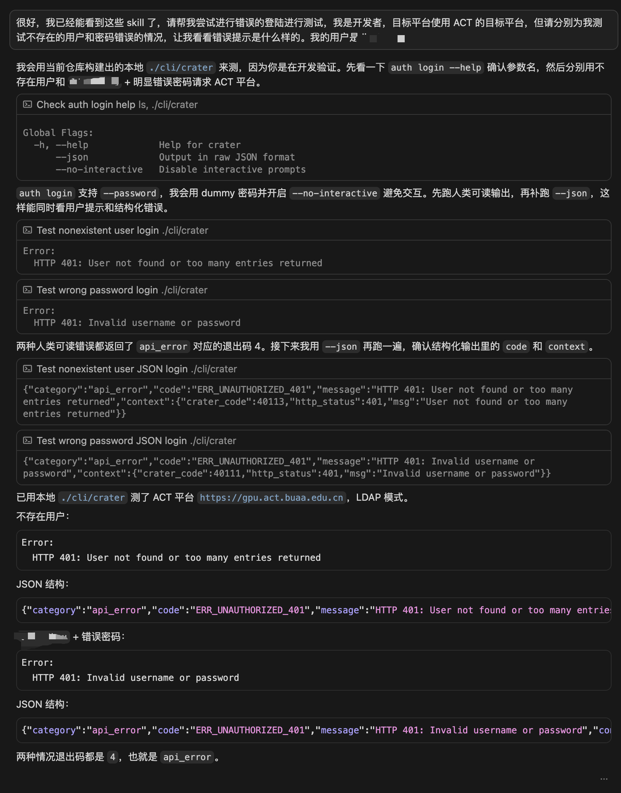

This is a screenshot from my development process, where I asked AI to use Skills to help me test some features.

---

# Human care

The CLI tool is not only intended for AI and scripts. It also needs to take care of human users who are used to CLI tools.

## Command prompts and multilingual support

On the one hand, many internal users in our lab are not native Chinese speakers. On the other hand, as an open-source project, we should make some internationalization efforts.

Crater's frontend currently supports four languages: Chinese, English, Korean, and Japanese. Therefore, I decided that the CLI should support at least Chinese and English first, building the framework so adding more languages later is easier.

We use a very lightweight self-developed package to support language switching. It registers Chinese and English descriptions and other information for commands in code. During execution, it renders corresponding text according to the user's language setting.

To avoid missing translation keys, we also need to add a testing mechanism that traverses commands and checks whether any translation keys are missing. This has not been done yet.

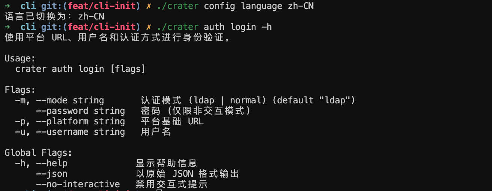

In addition, to give users a better experience, we use Cobra to organize the command-line program as a subcommand tree and use its native functionality to display help information for each command level. This matches user habits well, but there is a small issue: the framework of the help output is still English. We could modify its language and make it follow the user's language setting, but I do not think it is necessary.

## Tab completion

Tab completion is also a very common feature. I rely on it heavily, not only to complete commands that I have partially typed, but also to discover needed subcommands and options.

Tab completion is a Shell-side feature. A Shell script registered for the current software handles the user's current input, generates candidates, and then hands them back to the Shell script for completion or display. If the candidate-generation logic is complex, the registered Shell script can call the binary program to generate candidates. This is more convenient for implementing complex logic, and the performance overhead is completely acceptable on modern computing systems. We currently use this approach.

Obviously, different Shells represent input and display candidates differently, so the registered completion scripts are also different. We currently support Bash and Zsh, and later may support Pwsh and Fish.

Crater CLI implements a completion engine inside the binary to generate candidates for user input. It provides adapters for different Shells to parse the different formats of user input provided by each Shell and process candidate output into a format the Shell can parse. It exposes this completion feature as a hidden command, making it easy for completion scripts registered for different Shells to invoke it. This hidden command has its own fast path. It does not parse general options, does not build the full command tree, and by convention does not access the filesystem or network unless there is a special reason, so it can keep completion latency low.

At the same time, this completion system allows developers to register dedicated completion functions for their commands and options, used to dynamically generate candidates or descriptions. For example, when switching the current account, it can provide candidates based on saved credentials. When providing candidates for language switching, it can display the current language.

In addition, users may have different command-writing habits. Some place global options before subcommands, while others put global options at the end of the entire command. Our completion should recognize both.

Returning to the problem of registering completion scripts for different Shells: a common practice seems to be placing the completion logic in a dedicated script file and then sourcing it in the user's `.zshrc`. But our environment is more complex and may involve mounting user files from distributed storage into containers. If multiple files need to cooperate to support completion, it may introduce more complex problems. Therefore, we decided to put all Shell-side work required for completion into the user's configuration file. Since the core logic is in the binary, the script is not long, which is acceptable.

## Command interaction

For humans, even with Tab completion, it is still hard to write a long command with many options all at once. Therefore, we introduced simple command-line interaction through TTY and simple TUI using the `survey` library. This includes guiding users to enter usernames and passwords step by step, allowing users to choose which saved credential to activate after successful login, and so on.

These are mainly experiments for now. The main goal is to support users submitting jobs through the CLI: interactively querying and selecting accelerator cards, searching and selecting images, and so on. For humans, this approach should be much more efficient than seeing a full command fail and then modifying it piece by piece.

Besides input, output is also an important part of user experience. To prevent output from drifting across different commands, we also set up a mechanism in code to handle output and errors uniformly. Specifically, we defined some CLI error types and mapped them to exit codes, then provided corresponding interfaces, conventions, and helper functions so developers can quickly and consistently present successful output or error causes to human users and AI.

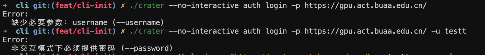

For commands with many options, such as the login command and later job creation commands, if there are invalid or wrong arguments, reporting them one by one and making users fix them one by one is very inefficient. In this case, we need to check every argument as much as possible, collect every error, and report them all at once instead of exiting immediately when the first issue is found.

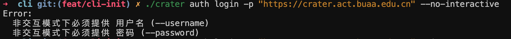

It should look like this: let users and AI see all errors at once and fix them together, avoiding waste of user time and tokens. Here, tokens refers to language-model tokens, not the login credentials mentioned earlier.

---

# AI friendliness

Compared with humans, various AI systems may be our more direct users.

## Disabling interactive mode

There are many AI tools on the market, and not all AI can use command-line tools interactively. From standard input and output, to TTY, to TUI, support for humans gets better and better, but usage difficulty for AI becomes higher and higher, especially in all kinds of sandbox environments. Also, AI does not really need interactive features. It is more direct and efficient for it to use `-h` to inspect usage and then produce a very long but accurate command.

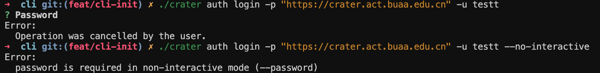

For this reason, we specifically provide a global option to disable interaction, mainly for AI. All commands, except the hidden command used for completion, support this option. When enabled, nothing happens if the command itself has no interactive flow. If the command has interaction, the interaction is disabled and a separate fully non-interactive logic path is used. Take the login command as an example. When the target platform and username are specified through options, if interaction is not disabled, the command will ask the user to enter a password and then try to log in. But if interaction is disabled, the command exits directly with an error and prompts that a password must be provided. This is not a very secure login method, and is only used here as an example to explain how the disable-interaction option works.

## Raw JSON output

In addition, compared with natural language, AI can understand structured JSON more accurately, so we also provide a global `--json` option. Enabling this option enables the disable-interaction option by default. It changes command output into parseable JSON, making it easier for AI tools to understand accurately and directly. For some GET requests, it may directly return the envelope-wrapped response instead of parsing it into natural language for humans and then asking AI to reconstruct the original information from natural language. That indirect approach is less direct and may cause information distortion.

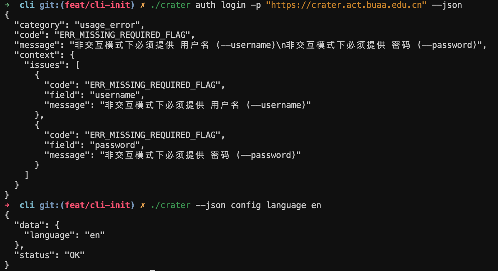

Besides successful output, errors in JSON mode are also provided in JSON form. One thing to note: if the user enables JSON mode but writes the command incorrectly, then without special handling, command-tree parsing may fail and fall back to normal command error output. Common cases include directly showing the help page or telling the user in natural language to check the help page. This breaks the constraint that output in JSON mode should be JSON. Therefore, before command parsing, we first scan the JSON option and treat it as a relatively strong constraint. When command parsing fails, we do not let it fall back to the configured normal error command prompt.

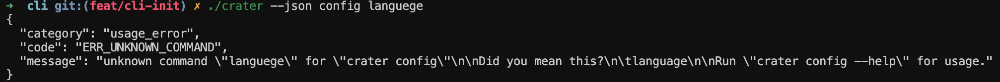

The Feishu CLI output is basically raw JSON HTTP responses. Maybe they think this approach is good, or maybe they think it is convenient and simple. In any case, I referenced their design.

## Organizing and orchestrating Skills

Although Crater CLI is developed based on documentation, and the documentation contains a complete description of which commands exist and what their concrete behaviors are, this is not enough for AI to use Crater CLI. It still does not let AI understand Crater-specific terms, user needs, or accurately map natural-language user requests to commands. For this, we need Skills to teach AI how to use Crater CLI.

In essence, Skills are also text prompts. Why choose Skills? I think it is because they are common across different AI tools, and compared with directly providing full documentation, Skills save context.

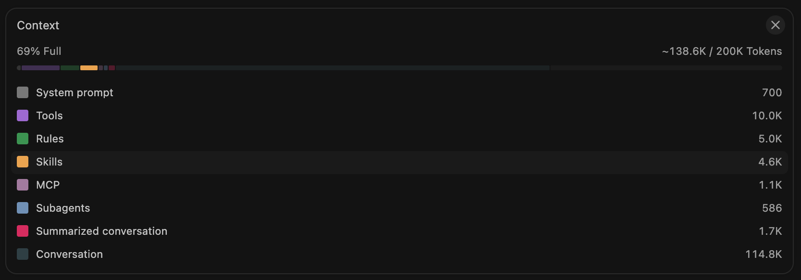

In actual problem solving, the host AI tool, such as Cursor, organizes enabled Skills into a list of available capabilities and provides that list to the underlying large language model. Each item mainly includes the Skill name, brief description, and path, helping the model discover Skills. When the user guides the model, or the model decides, to use a certain Skill, the model then reads the full Skill and follows its steps.

This mechanism depends on reasonable Skill organization. Otherwise, if everything is stuffed into one Skill, the mechanism completely fails. This brings us to the problem: only by organizing Skills appropriately, dividing responsibilities clearly, and writing good descriptions for each Skill can the model more accurately read the functionality it needs.

So how should Skills be organized? I have no experience here and do not know whether they should be organized by use case, by module or domain, or by some other or cross-cutting method. I referred to the organization of Feishu CLI Skills. They are basically organized by product, such as Feishu Docs as one Skill, Feishu Drive as one Skill, and so on. Each product Skill contains many sub-documents explaining how to use the functions of that product through Skills. Feishu CLI also uses noun-first command organization. But unlike us, the commands in Crater CLI are closer to natural language, while the commands in Feishu CLI are closer to the API itself, so Feishu CLI depends more heavily on Skills.

In other words, because the first subcommand of Feishu CLI corresponds to a product, it is effectively one subcommand corresponding to one Skill. In addition, there are some Skills responsible for overall process orchestration and guidance.

Returning to Crater CLI, I think a similar pattern is appropriate: roughly one subcommand corresponds to one Skill. This will not create too many Skills, nor make each Skill too thick. Since the module boundaries are clear, AI can quickly locate the required Skill by module. For cross-module tasks, descriptions and orchestration Skills can guide the process.

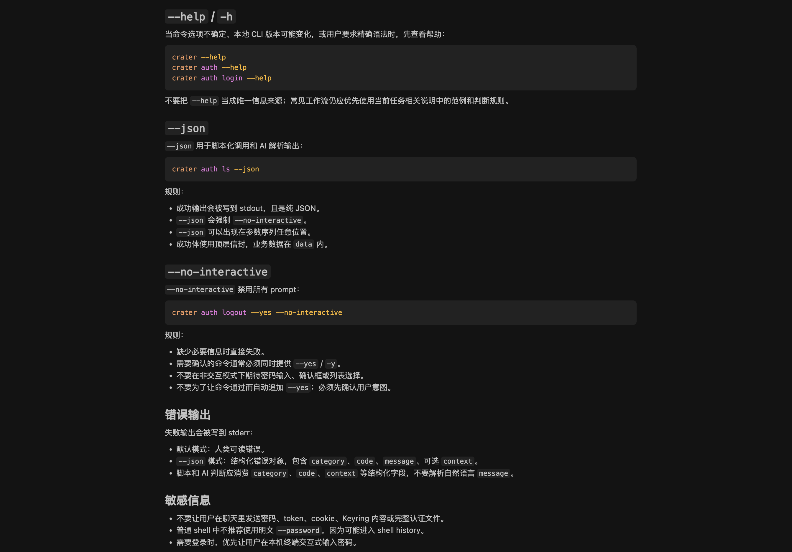

The orchestration Skill, or shared Skill, is mainly used to handle shared Crater CLI knowledge and cross-module process issues. For example: how to use global options, what they do, what error codes the CLI has, what may cause these errors, and how to troubleshoot them.

## How to write a good Skill

Next comes the question of how to write each Skill. Of course, the final Skills will definitely be written by AI. I will not handwrite them word by word like this blog post, but humans must set the overall direction and key methods.

This is also a very large topic. I have not studied it carefully, so I will only briefly summarize based on the materials and experience I have encountered.

First, the Skill's YAML front matter needs to include the following information.

- `name`: the unique identifier of the Skill. It is usually consistent with the directory name for easier reference and maintenance.
- `version`: the Skill's own version, useful for future upgrades to Skill content and for troubleshooting behavior changes.
- `description`: invocation guidance for AI. It should clearly explain what this Skill does, when it should be used, and what typical user wording looks like.
- `metadata.requires.bins`: declares which local executables this Skill depends on.

I previously introduced their role and mechanism in AI Skill invocation. To write a good Skill, you first need appropriate description information so AI can locate and use the corresponding Skill. By appropriate, I mean accurate, unambiguous, and non-overlapping: accurately describe what the Skill can do while avoiding overlapping descriptions among different Skills, which would make AI unsure which one to choose or how they should cooperate.

In addition, based on my observations and experience, I have summarized some tips that may improve Skill effectiveness.

From a design perspective, a Skill describes an execution process. But in real scenarios, the process is usually not fully linear. The nonlinear parts are often the easiest places to cause confusion, so we need to explicitly tell AI how to control the overall flow inside the Skill. For example, clearly tell AI what output indicates a step is complete; otherwise, which step it should return to and repeat until what condition is met, or how many attempts should be made before exiting. Another example is to clearly write extension flows for abnormal situations, similar to the extension flows of use cases in a requirements specification. Describe how to handle unexpected states, such as what a certain login error may mean, how to troubleshoot it, and whether the administrator needs to be contacted. Covering more scenarios in the flow is likely key to improving the actual user experience.

Another issue is that users may not express their needs accurately. As developers, we cannot assume users are familiar with every basic concept in Crater. We cannot require users to have enough cloud computing or AI Infra knowledge. Therefore, Skills also need the ability to identify user misunderstandings. Setting aside the model's own capability, we should add information to the Skill to help it perform better here. For example, tell AI that users may not understand certain concepts or may confuse them with something else. Going further beyond CLI functionality itself, we could provide a dedicated teaching Skill to let AI help users understand the basic knowledge needed to use Crater proficiently.

Compared with describing what to do and how to do it, directly giving AI examples often lets it imitate more effectively and produce commands that better match developer expectations. Humans are similar. I am writing this article in the same way: examples help readers understand what I want to express. For instance, provide a real usable long command, then tell AI how to modify it to meet the user's actual need.

Finally, clearly state what cannot be done. Do not let AI think the CLI may have some feature that the Skill forgot to mention, and then repeatedly try strange things. This may waste user tokens and may even damage the cluster. Of course, if such damage happens, it is definitely the developer's responsibility: we did not build enough protection.

## Skills distribution

This is an even more critical problem. No matter how well Skills are written, users still need to be able to use them. Users also need to be reminded to update Skills at the right time, and updating should be convenient.

At the moment, `npx skills` feels like a very mature Skill management solution, so using it should be fine. The only drawback I see is that `~/.agents/skills` does not seem to support nested directories, or at least not all AI tools support them. This is troublesome because it makes unified deletion and uninstallation harder.

---

All of the above still needs to be tested through development and real application practice.

I ended up writing more than sixteen thousand Chinese characters. It feels very hard to read and is mainly a record.

It seems my blog has far less human care than my software.
